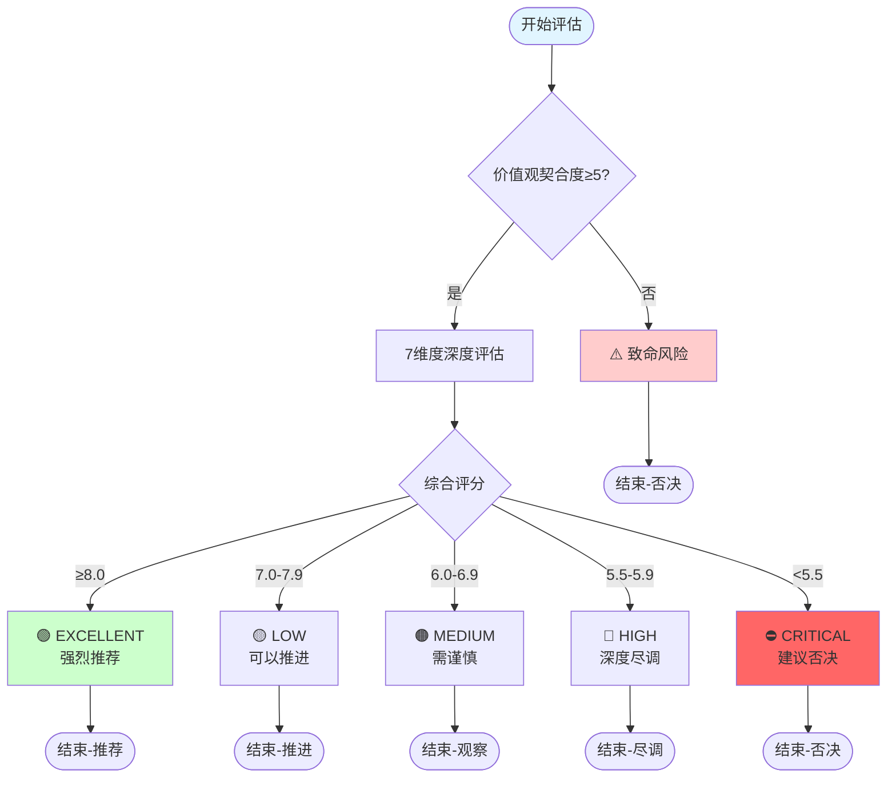
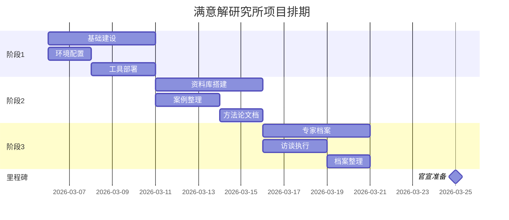
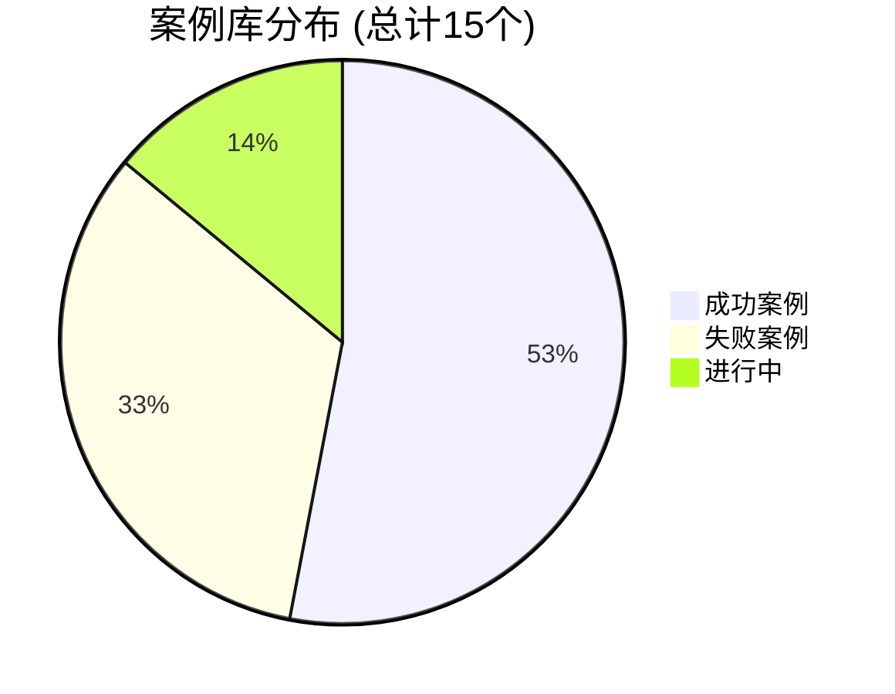

# 🎨 多格式交付能力扩展计划 V1.0.0

## 📋 管理规则声明

**本Skill严格遵循**:
1. **Skill运营管理规则**: `docs/SKILL_MANAGEMENT_RULES.md`
2. **决策安全红线**: `DECISION_SAFETY_RED_LINES.md`

**成本策略**:
- 优先使用Kimi（包月，零边际成本）
- Mermaid图表本地渲染（零成本）
- 数据可视化使用本地工具

---

## 🎯 功能概述

### 解决的问题
- 纯文字交付不够直观
- 复杂流程难以用文字描述
- 数据分析缺乏可视化
- 汇报材料制作耗时

### 核心价值
- **可视化呈现**: 复杂概念一键转图表
- **多格式输出**: 同一份内容多种表现形式
- **效率提升**: 自动生成专业级图表
- **互动性增强**: Mermaid代码可二次编辑

### 适用场景
- 决策流程可视化
- 项目架构图绘制
- 数据分析报告
- 时间轴/Gantt图
- 思维导图生成
- PPT大纲生成

---

## 🚀 使用方法

### 基本用法：生成Mermaid流程图
```
用户: 把以下流程转成Mermaid图表：
     用户提出需求 → 需求类型判断 → 直接回答/启动子代理/立即上报

AI: ```mermaid
   graph TD
       A[用户提出需求] --> B{需求类型判断}
       B -->|信息查询| C[直接回答]
       B -->|任务执行| D[启动子代理]
       B -->|紧急事项| E[立即上报]
       
       C --> F[代码块交付Markdown]
       D --> G[并行处理]
       G --> H[更新任务状态]
       
       E --> I[飞书静默通知]
       F --> J[入库A满意哥专属文件夹]
       H --> J
       
       J --> K[每日晨报汇总]
       I --> L[等待用户响应]
       
       style A fill:#f9f,stroke:#333,stroke-width:2px
       style E fill:#f96,stroke:#333,stroke-width:2px
       style J fill:#9f9,stroke:#333,stroke-width:2px
   ```
   
   📖 **使用指引**:
   1. 复制上面的Mermaid代码
   2. 打开 https://mermaid.live
   3. 粘贴即见图形
   4. 可导出PNG/SVG/PDF
```

### 高级用法：数据转可视化
```
用户: 把以下数据转成可视化图表：
     2026-03-06: 基础建设 5项
     2026-03-07: 资料库搭建 3项
     2026-03-08: 专家档案 4项

AI: 📊 数据可视化方案
   
   ### 1. Mermaid柱状图
   ```mermaid
   xychart-beta
       title "本周任务完成统计"
       x-axis [03-06, 03-07, 03-08]
       y-axis "任务数" 0 --> 6
       bar [5, 3, 4]
   ```
   
   ### 2. 数据看板表格
   | 日期 | 任务类型 | 完成数量 | 完成率 |
   |---|---|---|---|
   | 03-06 | 基础建设 | 5 | 100% |
   | 03-07 | 资料库搭建 | 3 | 100% |
   | 03-08 | 专家档案 | 4 | 100% |
   
   ### 3. 趋势分析
   - 日均完成任务: 4项
   - 累计完成: 12项
   - 趋势: 稳定
```

---

## ⚙️ 技术实现

### 依赖工具
- **本地工具**: python3
- **图表引擎**: Mermaid (通过代码生成)
- **数据工具**: DuckDB (本地零成本)

### 输入格式
```
内容类型: 流程描述 | 数据表格 | 时间规划 | 思维导图
输入方式: 自然语言描述 | CSV数据 | 列表结构
```

### 输出格式
```markdown
1. Mermaid图表代码 (可渲染)
2. 可视化表格 (Markdown格式)
3. 数据洞察 (文字分析)
4. 使用指引 (如何进一步处理)
```

### 处理流程
1. **内容分析**: 识别输入内容类型
2. **格式选择**: 根据场景选择最佳可视化方式
3. **代码生成**: 生成Mermaid/DuckDB查询
4. **多格式输出**: 提供多种格式供选择
5. **使用指引**: 说明如何导出和使用

---

## 💰 成本估算

### 单次调用成本
- **Mermaid图表**: ¥0（纯代码生成）
- **数据可视化**: ¥0（本地处理）
- **PPT大纲**: ¥0（文本生成）
- **Gantt图**: ¥0（代码生成）

### 月度成本估算
- **所有功能零成本运行**
- 仅消耗Kimi包月额度（已包含）

---

## 🔒 安全考虑

### 数据流向
- **输入数据**: 用户提供的内容
- **处理过程**: 本地代码生成
- **输出数据**: Mermaid代码/Markdown表格

### 权限要求
- **文件读取**: 无
- **文件写入**: 无（纯代码输出）
- **网络请求**: 可选（Mermaid Live Editor链接）

### 风险提示
- ⚠️ Mermaid代码需在支持的环境渲染
- ⚠️ 复杂图表可能超出Mermaid能力范围
- ⚠️ 大数据量建议使用专业BI工具

---

## 📝 使用示例

### 示例1: 决策树可视化
**输入**:
```
用Mermaid画一个合伙人评估决策树：
- 初筛：价值观契合度≥5？
- 深度评估：7维度评分
- 风险预警：综合分<6.5？
- 决策建议：推荐/谨慎/否决
```

**输出**:
```markdown
🌳 合伙人评估决策树



📋 **使用步骤**:
1. 复制代码 → https://mermaid.live
2. 实时预览决策树
3. 导出PNG用于汇报
```

### 示例2: Gantt项目排期
**输入**:
```
生成项目排期Gantt图：
- 阶段1: 基础建设 (3月6-10日)
- 阶段2: 资料库搭建 (3月11-15日)
- 阶段3: 专家档案 (3月16-20日)
- 里程碑: 官宣准备 (3月25日)
```

**输出**:
```markdown
📅 项目排期Gantt图



📊 **关键路径**: 基础建设 → 资料库搭建 → 专家档案 → 官宣准备
```

### 示例3: 数据可视化报告
**输入**:
```
把以下案例数据可视化：
成功案例: 8个
失败案例: 5个
进行中: 2个
预测准确率: 85%
平均评估时长: 8-10分钟
```

**输出**:
```markdown
📊 案例库数据可视化报告

### 1. 案例分布饼图


### 2. 关键指标仪表
| 指标 | 数值 | 目标 | 达成率 |
|------|------|------|--------|
| 预测准确率 | 85% | 80% | ✅ 106% |
| 平均评估时长 | 9分钟 | 10分钟 | ✅ 优秀 |
| 案例库规模 | 15个 | 30个 | 🔄 50% |

### 3. 洞察总结
- ✅ 预测准确率超过目标
- ✅ 评估效率优秀
- 🔄 案例库需继续扩充
```

---

## 🐛 故障排除

### 常见问题1: Mermaid渲染失败
**原因**: 代码语法错误或包含特殊字符
**解决**:
1. 检查语法是否正确
2. 避免中文括号，使用英文括号
3. 特殊字符需转义

### 常见问题2: 复杂图表显示混乱
**原因**: 节点过多或层级过深
**解决**:
1. 拆分为多个子图
2. 使用subgraph分组
3. 简化流程步骤

### 常见问题3: 数据可视化格式错乱
**原因**: 数据格式不规范
**解决**:
1. 确保数据为纯文本
2. 使用标准分隔符
3. 检查数据完整性

---

## 🔄 更新计划

### 近期更新（本月内）
- [ ] 增加更多Mermaid图表类型
- [ ] 添加图表模板库
- [ ] 支持自定义配色方案

### 中期更新（本季度）
- [ ] 集成PlantUML支持
- [ ] 增加数据导入功能（CSV/Excel）
- [ ] 批量图表生成功能

### 长期规划（本年度）
- [ ] 自动生成完整PPT
- [ ] 集成更多可视化引擎
- [ ] AI自动选择最佳图表类型

---

## 📝 版本更新日志

### v1.0.0 (2026-03-15)
- **创建**: 初始版本，基于多格式交付能力扩展计划文档
- **功能**:
  - Mermaid流程图生成
  - 数据可视化转换
  - Gantt图生成
  - 决策树可视化
  - 多种图表格式输出

---

## 📚 相关文档

- **源文档**: `A满意哥专属文件夹/00_🧭 罗盘指南/多格式交付能力扩展计划.md`
- **Mermaid文档**: https://mermaid.js.org/
- **Mermaid Live**: https://mermaid.live
- **管理规则**: `docs/SKILL_MANAGEMENT_RULES.md`

---

*版本: v1.0.0*  
*创建: 2026-03-15*  
*作者: Satisficing Institute*  
*下次评估: 2026-04-15*
