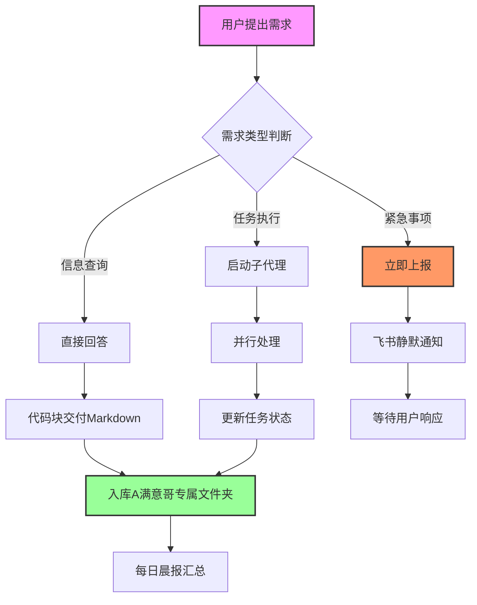

# 🎨 满意妞 · 多格式交付能力扩展计划

> **目标：** 解锁 Mermaid、数据可视化、PPT 等多元交付格式  > **（skill已完成更新 - 2026-03-12）**

---

## 🧪 今日实战测试成果

### 测试1：Mermaid 流程图 ✅

**已生成代码：**


**你的工作流：**
1. 复制上面的 Mermaid 代码
2. 打开 [Mermaid Live Editor](https://mermaid.live)
3. 粘贴代码 → 实时预览 → 下载 PNG/SVG

**以后我的交付：**
- 复杂流程 → Mermaid 代码 + 渲染指引
- 架构图 → Mermaid 代码块
- 时间轴 → Mermaid Gantt 图

---

### 测试2：Excel 数据 → 选题转化 ⏳ 准备中

**模拟数据准备：**
```csv
日期,任务类型,完成数量,阻塞数量,完成率
2026-03-06,基础建设,5,0,100%
2026-03-07,资料库搭建,3,0,100%
2026-03-08,专家档案,4,0,100%
2026-03-09,基础设施,6,0,100%
2026-03-10,管理规则,8,1,89%
2026-03-11,访谈准备,2,1,67%
2026-03-12,全面优化,12,0,100%
```

**Prompt 1 测试（数据→选题）：**
> "基于本周任务完成数据，生成3个内容选题方向，要求：
> 1. 每个选题有数据支撑
> 2. 符合满意解研究所定位
> 3. 有明确的标题和角度"

---

## 📊 多元交付格式矩阵

| 内容类型 | 当前格式 | 新增格式 | 使用场景 |
|:---|:---:|:---:|:---|
| **流程/架构** | 文字描述 | ✅ Mermaid 图表 | 工作流程、系统架构 |
| **数据分析** | CSV表格 | ✅ 可视化图表 | 趋势分析、对比分析 |
| **报告文档** | Markdown | ✅ PPT大纲 | 路演、汇报 |
| **时间规划** | 列表 | ✅ Gantt图 | 项目排期、里程碑 |
| **思维导图** | 大纲 | ✅ 脑图代码 | 知识梳理、决策树 |
| **原型设计** | 文字描述 | ✅ 简易线框 | 产品概念、界面草图 |

---

## 🎯 具体使用场景

### 场景1：向专家汇报项目进展

**以前：**
> "本周完成了X、Y、Z三个任务..."

**以后：**
```markdown
## 本周进展可视化

### 流程图
[Mermaid代码]

### 数据看板
[可视化图表]

### 下周计划 Gantt 图
[Mermaid Gantt代码]
```

### 场景2：官宣内容策划

**以前：**
> "官宣文案主题是..."

**以后：**
```markdown
## 官宣内容脑图
[Mermaid Mindmap代码]

### 发布节奏时间轴
[Gantt图]

### 五路图腾视觉流程
[流程图]
```

### 场景3：决策分析

**以前：**
> "建议选择A方案，因为..."

**以后：**
```markdown
## 决策分析图

### 决策树
[Mermaid Decision Tree]

### 对比矩阵
[可视化表格]

### 风险热力图
[简易ASCII或Mermaid]
```

---

## 🛠️ 工具链整合

### Mermaid 生态系统

| 工具 | 用途 | 链接 |
|:---|:---|:---|
| **Mermaid Live Editor** | 实时编辑、导出PNG/SVG | https://mermaid.live |
| **Mermaid CLI** | 命令行批量转换 | npm install -g @mermaid-js/mermaid-cli |
| **GitHub Markdown** | 原生支持Mermaid渲染 | 直接在GitHub查看 |

### 数据可视化工具

| 工具 | 用途 | 集成方式 |
|:---|:---|:---|
| **Kimi 深度研究** | 数据分析、洞察提取 | API调用 |
| **Mermaid Pie/XY** | 简单图表 | 代码生成 |
| **DuckDB + 图表** | 复杂数据分析 | SQL + 可视化 |

---

## 📋 立即执行清单

### 今天完成
- [x] Mermaid 流程图测试
- [ ] Excel数据 → 选题转化测试
- [ ] 生成第一个可视化报告（本周进展）

### 本周完成
- [ ] 建立Mermaid模板库（流程图、Gantt、脑图）
- [ ] 数据→可视化工作流标准化
- [ ] PPT大纲生成测试

### 持续优化
- [ ] 根据使用反馈迭代模板
- [ ] 建立常用图表快捷生成指令

---

## 💡 给你的操作指引

### 如何使用 Mermaid 交付

**当我给你Mermaid代码时：**

1. **快速预览**
   - 复制代码
   - 打开 https://mermaid.live
   - 粘贴即见图形

2. **保存使用**
   - 在Mermaid Live Editor点击"PNG"下载
   - 或保存.svg用于后续编辑

3. **文档嵌入**
   - Markdown文件直接支持Mermaid渲染
   - GitHub/GitLab原生支持

### 如何请求特定格式

| 你想要... | 对我说... |
|:---|:---|
| 流程图 | "用Mermaid画个流程图" |
| 时间轴 | "生成Gantt图排期" |
| 脑图 | "用脑图梳理XX" |
| 数据可视化 | "把这个数据可视化" |
| PPT大纲 | "生成PPT大纲" |

---

*从这份文档开始，交付不再局限于文字和表格。*
*可视化、流程化、多元化——这才是Kimi会员的完整价值。*
