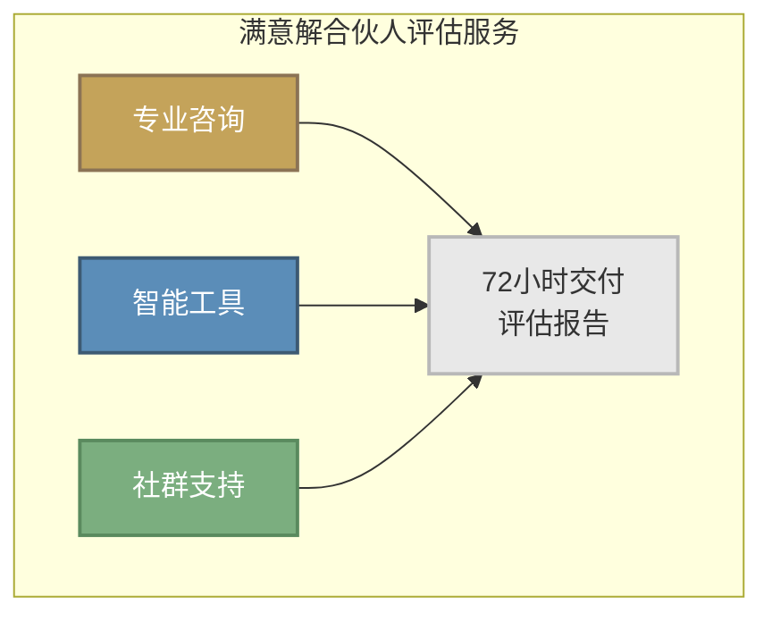
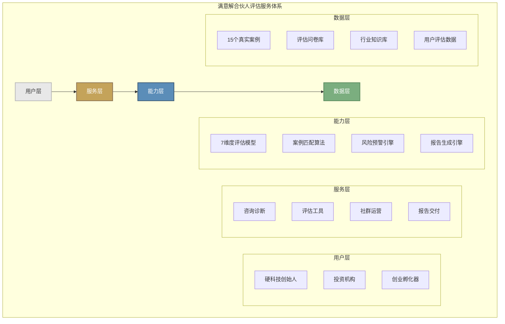
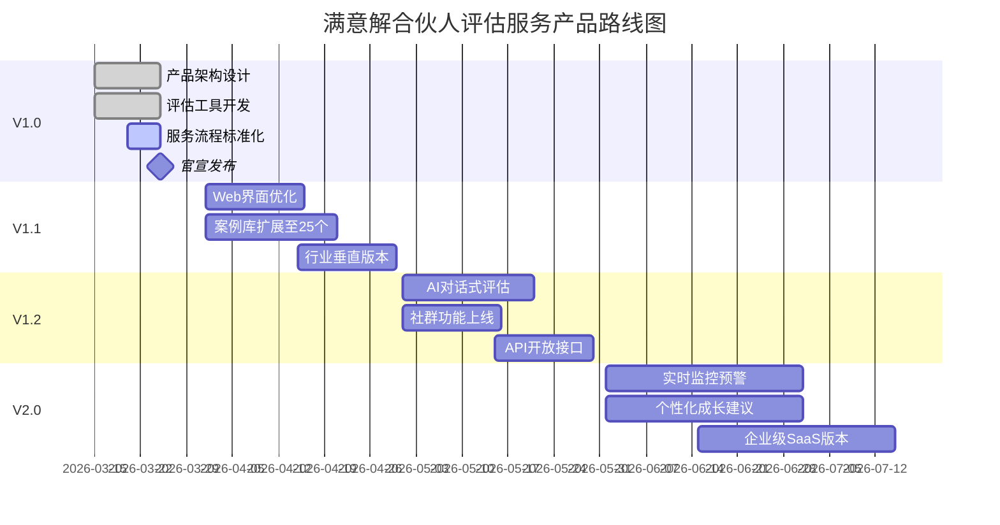

# 满意解合伙人评估服务 · 产品架构V1.0

**文档版本**: V1.0  
**发布日期**: 2026年3月25日  
**所属组织**: 满意解研究所  

---

## 一、产品定位

### 1.1 核心产品

**满意解合伙人评估决策服务**是专为硬件初创企业家设计的专业级合伙人匹配评估解决方案。

基于满意解研究所对15个真实案例的深度研究，结合赫伯特·西蒙的满意解决策理论，我们提供科学、系统、可落地的合伙人评估服务，帮助创业者在有限信息和时间压力下，找到满足核心标准的"满意解"。

### 1.2 目标用户

| 用户画像 | 核心痛点 | 需求场景 |
|----------|----------|----------|
| 硬科技创始人 | 合伙人选择困难 | 技术出身，商业经验不足 |
| 连续创业者 | 踩过合伙人坑 | 希望科学决策避免重蹈覆辙 |
| 投资机构 | 被投企业纠纷 | 需要第三方评估背书 |
| 创业孵化器 | 入驻项目辅导 | 标准化合伙人匹配服务 |

### 1.3 核心价值主张

```
┌─────────────────────────────────────────────────────────────────────┐
│                                                                     │
│    从"凭直觉选合伙人"  →  "用科学方法找满意解"                    │
│                                                                     │
│    ✓ 7维度系统化评估框架                                           │
│    ✓ 15个真实案例验证                                              │
│    ✓ 72小时快速交付评估报告                                        │
│    ✓ 可视化风险预警系统                                            │
│                                                                     │
└─────────────────────────────────────────────────────────────────────┘
```

---

## 二、产品形态

### 2.1 三位一体服务模式



### 2.2 形态一：专业咨询

**服务内容**：
- 1对1需求诊断访谈（60分钟）
- 候选人7维度深度评估
- 结构化评估报告
- 专家解读与建议

**适用场景**：
- 已有候选人，需要专业评估
- 重大决策前的第三方意见
- 合伙人关系危机诊断

**服务形式**：
- 线上视频咨询
- 线下深度访谈
- 异步评估（填写问卷+报告解读）

### 2.3 形态二：智能工具

**产品矩阵**：

| 工具名称 | 功能定位 | 交付形式 |
|----------|----------|----------|
| 快速评估器 | 5分钟自测，快速筛选 | Web/小程序 |
| 深度评估系统 | 18题完整评估 | Web应用 |
| 评估报告生成器 | 可视化报告输出 | PDF/HTML |
| 案例匹配引擎 | 相似案例推荐 | 在线查询 |

**核心功能**：
- 7维度18题评估问卷
- 智能评分算法
- 风险等级判定
- 个性化建议生成
- 可视化报告导出

### 2.4 形态三：社群支持

**社群组成**：
- 硬科技创业者社群
- 合伙人评估校友会
- 行业垂直社群（半导体/生物医药/新能源）

**社群权益**：
- 评估报告分享与讨论
- 成功案例经验交流
- 专家定期答疑
- 合伙人匹配资源对接

---

## 三、产品架构

### 3.1 整体架构图



### 3.2 核心能力层详解

#### 能力1：7维度评估模型

基于15个案例验证的评估框架：

| 维度 | 权重 | 评估要点 | 数据来源 |
|------|------|----------|----------|
| 价值观契合度 | 20% | 创业动机、风险偏好、商业伦理 | 深度访谈 |
| 能力互补性 | 20% | 技能、经验、资源互补程度 | 背景调查 |
| 承诺可信度 | 15% | 全职投入、时间/资源承诺 | 访谈验证 |
| 沟通效率 | 15% | 沟通风格、决策节奏 | 情景测试 |
| 利益一致性 | 15% | 股权分配、退出预期 | 深度访谈 |
| 退出可接受性 | 10% | 退出机制、分手成本 | 协议审查 |
| 成长匹配度 | 5% | 学习能力、适应速度 | 背景调查 |

#### 能力2：案例匹配算法

```
输入：当前评估对象特征
处理：
  1. 提取7维度特征向量
  2. 与案例库进行相似度计算
  3. 匹配最相似的3个案例
输出：相似案例 + 经验教训
```

#### 能力3：风险预警引擎

**三级预警体系**：

| 级别 | 信号类型 | 处理方式 |
|------|----------|----------|
| 红旗 | 一票否决项 | 立即终止 |
| 黄灯 | 需关注项 | 设计缓释机制 |
| 蓝灯 | 可优化项 | 持续改进 |

#### 能力4：报告生成引擎

**报告组成**：
- 执行摘要（1页）
- 综合得分与风险等级（1页）
- 7维度详细分析（3-4页）
- 案例对标分析（1-2页）
- 行动建议清单（1页）

### 3.3 数据资产层

| 数据类型 | 数量 | 更新频率 | 用途 |
|----------|------|----------|------|
| 真实案例库 | 15个 | 每月新增 | 对标分析 |
| 评估问卷库 | 18题 | 持续优化 | 评估工具 |
| 行业知识库 | 覆盖6大行业 | 季度更新 | 行业洞察 |
| 用户评估数据 | 动态增长 | 实时 | 模型优化 |

---

## 四、交付标准

### 4.1 核心承诺：72小时交付

```
┌─────────────────────────────────────────────────────────────────────┐
│                     72小时服务承诺                                  │
├─────────────────────────────────────────────────────────────────────┤
│                                                                     │
│   T+0小时    →   需求确认 + 启动评估                                │
│                                                                     │
│   T+24小时   →   完成深度访谈/问卷                                  │
│                                                                     │
│   T+48小时   →   完成数据分析 + 报告初稿                            │
│                                                                     │
│   T+72小时   →   交付正式评估报告                                   │
│                                                                     │
└─────────────────────────────────────────────────────────────────────┘
```

### 4.2 评估报告交付物

| 交付物 | 格式 | 内容 | 页数 |
|--------|------|------|------|
| 综合评估报告 | PDF | 完整分析 + 建议 | 8-10页 |
| 可视化仪表板 | HTML | 交互式数据展示 | 1页 |
| 案例对标分析 | PDF | 相似案例对比 | 2-3页 |
| 行动建议清单 | PDF | 可执行建议 | 1页 |
| 专家解读录音 | MP3 | 30分钟深度解读 | - |

### 4.3 服务质量标准

**准确性标准**：
- 评估结果与后续合作结果一致性 ≥ 80%
- 风险预警命中率 ≥ 90%
- 案例匹配相关度 ≥ 85%

**时效性标准**：
- 72小时内交付率 ≥ 95%
- 紧急需求24小时内响应

**满意度标准**：
- 客户满意度 ≥ 4.5/5.0
- NPS（净推荐值）≥ 50

---

## 五、产品路线图

### 5.1 版本演进



### 5.2 V1.0 里程碑（当前）

**核心目标**：完成产品化，正式对外服务

**已完成**：
- ✅ 7维度评估模型V1.0
- ✅ 评估工具V2.0
- ✅ 15个案例库
- ✅ 方法论白皮书
- ✅ 产品手册
- ✅ 服务流程

**待完成（3月25日前）**：
- [ ] 产品架构文档V1.0
- [ ] 产品设计文档V1.0
- [ ] 定价体系
- [ ] 官宣物料包

---

## 六、竞争分析

### 6.1 竞品对比

| 维度 | 满意解服务 | 传统猎头 | 法律咨询 | 创业教练 |
|------|------------|----------|----------|----------|
| **评估深度** | 7维度系统化 | 能力匹配 | 法律合规 | 经验直觉 |
| **科学性** | 数据驱动 | 经验判断 | 法律框架 | 个人经验 |
| **交付速度** | 72小时 | 2-4周 | 1-2周 | 按需 |
| **行业聚焦** | 硬科技 | 全行业 | 全行业 | 全行业 |
| **价格区间** | ¥5,000-20,000 | ¥20,000-100,000 | ¥10,000-50,000 | ¥500-3,000/小时 |
| **可复用性** | 工具+方法论 | 一次性 | 一次性 | 个人依赖 |

### 6.2 差异化优势

```
┌─────────────────────────────────────────────────────────────────────┐
│                     核心差异化优势                                  │
├─────────────────────────────────────────────────────────────────────┤
│                                                                     │
│  1. 【数据验证】基于15个真实案例的实证研究                          │
│                                                                     │
│  2. 【科学方法】满意解决策理论 + 7维度评估框架                      │
│                                                                     │
│  3. 【行业聚焦】专注硬科技领域，懂行业语言                          │
│                                                                     │
│  4. 【快速交付】72小时标准交付，不耽误决策窗口                      │
│                                                                     │
│  5. 【可视化】专业报告 + 交互式仪表板                               │
│                                                                     │
│  6. 【可落地】不仅是评估，更是行动指南                              │
│                                                                     │
└─────────────────────────────────────────────────────────────────────┘
```

---

## 七、商业模式

### 7.1 收入模式

| 收入类型 | 占比目标 | 说明 |
|----------|----------|------|
| 咨询服务费 | 60% | 核心收入来源 |
| 工具订阅费 | 25% | SaaS订阅收入 |
| 企业定制 | 10% | 机构大客户 |
| 社群会员 | 5% | 增值服务 |

### 7.2 成本结构

| 成本类型 | 占比 | 说明 |
|----------|------|------|
| 人力成本 | 50% | 评估专家、产品开发 |
| 运营推广 | 25% | 获客、品牌 |
| 技术研发 | 15% | 工具开发、数据 |
| 其他 | 10% | 行政、场地 |

---

## 八、成功指标

### 8.1 北极星指标

**合伙人匹配成功率**：经评估后合作的合伙人，6个月后关系健康度 ≥ 7分的比例

### 8.2 关键指标

| 指标类型 | 指标名称 | V1.0目标 | V1.5目标 |
|----------|----------|----------|----------|
| 用户 | 累计评估用户数 | 100 | 500 |
| 用户 | 月度活跃用户 | 50 | 200 |
| 营收 | 月度营收 | ¥50,000 | ¥200,000 |
| 产品 | 评估完成率 | 80% | 90% |
| 产品 | 报告满意度 | 4.5/5 | 4.7/5 |
| 运营 | 客户推荐率 | 30% | 40% |

---

## 九、附录

### 9.1 术语表

| 术语 | 定义 |
|------|------|
| 满意解 | 西蒙提出的决策原则，设定渴望水平，超过即停止搜索 |
| 7维度框架 | 价值观、能力、承诺、沟通、利益、退出、成长 |
| 硬科技 | 需要长期研发投入、积累核心技术的科技领域 |
| 72小时交付 | 从需求确认到报告交付的标准服务周期 |

### 9.2 参考资料

1. 合伙人评估决策模型V1.0
2. 合伙人匹配决策方法论V1.0
3. 合伙人评估工具V2.0产品手册
4. 满意解案例库统计报告

---

**文档信息**

| 项目 | 内容 |
|------|------|
| 文档名称 | 满意解合伙人评估服务 · 产品架构V1.0 |
| 版本号 | V1.0 |
| 发布日期 | 2026年3月25日 |
| 所属组织 | 满意解研究所 |
| 文档状态 | 正式发布 |

---

*本架构文档版权归满意解研究所所有*
