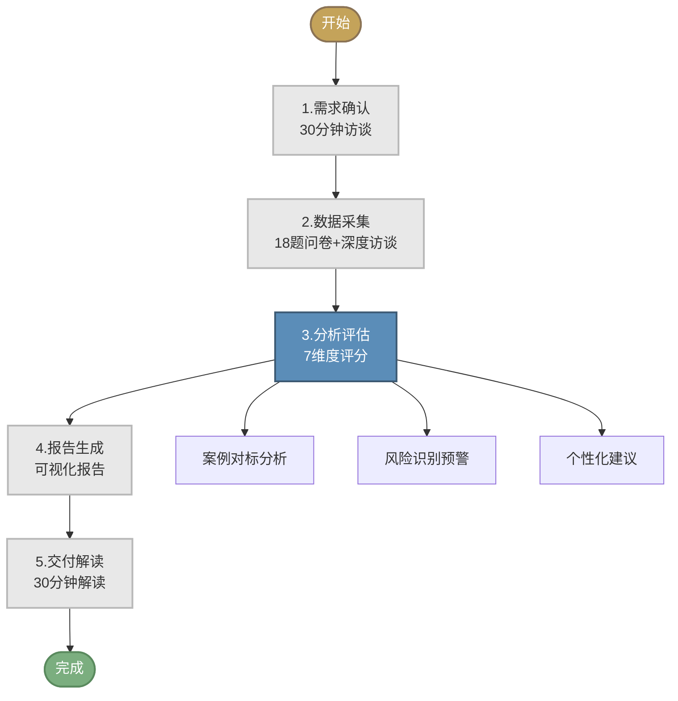

# 满意解合伙人评估服务 · 产品手册V1.0

<div align="center">

**满意解研究所**

*为硬科技创业者提供合伙人匹配决策支持*

---

**版本**: V1.0  
**发布日期**: 2026年3月25日

</div>

---

## 目录

1. [产品简介](#一产品简介)
2. [核心服务](#二核心服务)
3. [评估方法](#三评估方法)
4. [服务流程](#四服务流程)
5. [交付标准](#五交付标准)
6. [定价方案](#六定价方案)
7. [客户案例](#七客户案例)
8. [联系我们](#八联系我们)

---

## 一、产品简介

### 1.1 我们解决什么问题

在硬科技创业领域，合伙人的选择往往比商业模式更能决定企业的生死存亡。

**创业者的痛点**：
- ❌ 短期内难以全面了解对方的能力和品格
- ❌ 融资窗口、市场机会要求快速决策
- ❌ 被光环效应、相似性偏见误导
- ❌ 凭直觉和经验判断，缺乏系统性
- ❌ 一旦合作，退出成本极高

**我们的解决方案**：
基于满意解研究所对15个真实案例的深度研究，我们提供**科学、系统、可落地**的合伙人评估服务，帮助创业者在72小时内做出明智决策。

### 1.2 什么是"满意解"

诺贝尔经济学奖得主赫伯特·西蒙提出的**满意解决策理论**指出：

> "决策者并不拥有'完全理性'，而只有'有限理性'；不再追求'最优'，而只追求'满意'。"

在合伙人匹配中，我们放弃寻找"完美伴侣"的幻想，而是帮助您找到"足够好"且"可持续"的合作伙伴。

---

## 二、核心服务

### 2.1 服务形态

我们提供**咨询+工具+社群**三位一体的服务形态：

```
┌─────────────────────────────────────────────────────────────────┐
│                     三位一体服务                                │
├─────────────────┬─────────────────┬─────────────────────────────┤
│   专业咨询      │    智能工具      │         社群支持            │
├─────────────────┼─────────────────┼─────────────────────────────┤
│ • 1对1诊断     │ • 快速评估器    │ • 创业者社群                │
│ • 深度访谈     │ • 深度评估系统  │ • 校友会                    │
│ • 专家解读     │ • 报告生成器    │ • 资源对接                  │
│ • 定制建议     │ • 案例匹配引擎  │ • 专家答疑                  │
└─────────────────┴─────────────────┴─────────────────────────────┘
```

### 2.2 服务套餐

| 套餐 | 评估深度 | 交付周期 | 适合场景 |
|------|----------|----------|----------|
| **快速筛查** | 5分钟自测 | 即时 | 初步筛选多个候选人 |
| **标准评估** | 18题完整评估 | 72小时 | 正式决策前的深度评估 |
| **尊享服务** | 定制化深度尽调 | 1周 | 重大投资/关键决策 |

---

## 三、评估方法

### 3.1 7维度评估框架

基于15个真实案例验证的评估体系：

```
┌─────────────────────────────────────────────────────────────────┐
│                    满意解7维度评估框架                           │
├─────────────────────────────────────────────────────────────────┤
│                                                                 │
│   1. 价值观契合度 (20%)                                         │
│      → 创业动机、风险偏好、商业伦理                             │
│                                                                 │
│   2. 能力互补性 (20%)                                          │
│      → 技能、经验、资源互补程度                                 │
│                                                                 │
│   3. 承诺可信度 (15%)                                          │
│      → 全职投入、时间/资源承诺                                  │
│                                                                 │
│   4. 沟通效率 (15%)                                            │
│      → 沟通风格、决策节奏、冲突处理                             │
│                                                                 │
│   5. 利益一致性 (15%)                                          │
│      → 股权分配、退出预期、长期目标                             │
│                                                                 │
│   6. 退出可接受性 (10%)                                        │
│      → 退出机制、分手成本、竞业限制                             │
│                                                                 │
│   7. 成长匹配度 (5%)                                           │
│      → 学习能力、适应能力、进化方向                             │
│                                                                 │
└─────────────────────────────────────────────────────────────────┘
```

### 3.2 风险等级判定

根据综合得分，我们给出明确的风险等级和建议：

| 综合分 | 等级 | 建议 | 后续行动 |
|--------|------|------|----------|
| ≥8.0 | 🟢 EXCELLENT | 强烈推荐 | 进入尽职调查阶段 |
| 7.0-7.9 | 🟡 LOW | 可以推进 | 关注minor风险点 |
| 6.0-6.9 | 🟠 MEDIUM | 需谨慎 | 深度尽调+风险缓释 |
| 5.5-5.9 | 🔴 HIGH | 需深度尽调 | 专家会诊+备选方案 |
| <5.5 | ⚫ CRITICAL | 建议否决 | 终止合作考虑 |

### 3.3 关键洞察

**基于15个案例的核心发现**：

- ✅ 所有成功案例价值观契合度 ≥ 7分
- ✅ 能力互补是必要但不充分条件
- ✅ 全职承诺是硬科技创业的门槛
- ✅ 沟通效率决定日常合作体验
- ✅ 退出机制必须前置设计

---

## 四、服务流程

### 4.1 标准服务流程

```
┌─────────────────────────────────────────────────────────────────┐
│                    72小时标准服务流程                            │
├─────────────────────────────────────────────────────────────────┤
│                                                                 │
│  第1步：需求确认 (T+0)                                          │
│  └── 30分钟需求访谈，明确评估对象和关注点                       │
│                                                                 │
│  第2步：数据采集 (T+0~T+24)                                     │
│  └── 完成18题评估问卷 + 深度访谈                                │
│                                                                 │
│  第3步：分析评估 (T+24~T+48)                                    │
│  └── 7维度评分 + 案例对标 + 风险识别                            │
│                                                                 │
│  第4步：报告生成 (T+48~T+72)                                    │
│  └── 生成可视化报告 + 专家解读                                  │
│                                                                 │
│  第5步：交付解读 (T+72)                                         │
│  └── 30分钟报告解读 + 行动建议                                  │
│                                                                 │
└─────────────────────────────────────────────────────────────────┘
```

### 4.2 服务流程图



---

## 五、交付标准

### 5.1 评估报告内容

**标准评估报告（8-10页）包含**：

| 章节 | 内容 | 页数 |
|------|------|------|
| 1. 执行摘要 | 核心结论与建议 | 1页 |
| 2. 综合评估 | 总分、风险等级、雷达图 | 1页 |
| 3. 7维度分析 | 各维度得分与详细分析 | 3-4页 |
| 4. 案例对标 | 相似案例对比与启示 | 1-2页 |
| 5. 风险预警 | 风险信号识别与应对 | 1页 |
| 6. 行动建议 | 可执行的建议清单 | 1页 |

### 5.2 交付物清单

| 交付物 | 格式 | 说明 |
|--------|------|------|
| 综合评估报告 | PDF | 完整分析报告 |
| 可视化仪表板 | HTML/链接 | 交互式数据展示 |
| 案例对标分析 | PDF | 相似案例对比 |
| 行动建议清单 | PDF | 可执行建议 |
| 专家解读录音 | MP3 | 30分钟深度解读 |

### 5.3 服务质量承诺

- ✅ **72小时交付**：标准服务72小时内交付
- ✅ **准确性**：评估结果与后续合作一致性 ≥ 80%
- ✅ **满意度**：客户满意度 ≥ 4.5/5.0
- ✅ **保密性**：严格保护客户隐私和商业机密

---

## 六、定价方案

### 6.1 服务套餐定价

| 套餐 | 服务内容 | 原价 | **首发价** |
|------|----------|------|-----------|
| **快速筛查** | 5分钟自测 + 即时结果 | ¥99 | **免费** |
| **标准评估** | 18题评估 + 72小时报告 | ¥5,000 | **¥2,999** |
| **深度尽调** | 定制化评估 + 1周交付 | ¥15,000 | **¥9,999** |
| **尊享服务** | 深度尽调 + 90天陪跑 | ¥30,000 | **¥19,999** |

### 6.2 企业合作

| 合作类型 | 内容 | 价格 |
|----------|------|------|
| **机构套餐** | 10次标准评估 | ¥25,000 |
| **年度顾问** | 不限次评估 + 专属顾问 | ¥100,000/年 |
| **定制开发** | 白标工具 + 定制模型 | 面议 |

### 6.3 增值服务

| 服务 | 价格 |
|------|------|
| 专家1对1咨询（60分钟） | ¥1,999 |
| 案例库订阅（季度） | ¥499 |
| 社群会员（年度） | ¥999 |

---

## 七、客户案例

### 7.1 成功案例

> **CASE-001：AI芯片初创企业**
> 
> 技术极客与商业老兵的成功联姻
> - 背景：技术创始人寻找商业合伙人
> - 评估结果：综合得分 8.15，EXCELLENT
> - 现状：已完成A轮融资，团队稳定

> **CASE-010：精密仪器创业**
> 
> 技术专家与行业销售的老友创业
> - 背景：前同事重新聚首创业
> - 评估结果：综合得分 8.55，EXCELLENT
> - 现状：产品已进入市场验证阶段

### 7.2 避坑案例

> **CASE-002：服务机器人**
> 
> 价值观冲突导致的合作失败
> - 警示：技术方追求极致，资本方追求短期回报
> - 评估结果：价值观契合度仅2分
> - 结局：6个月后分道扬镳

> **CASE-009：AI大模型**
> 
> 学术明星陷阱
> - 警示：学术声誉不等于创业承诺
> - 评估结果：承诺可信度仅3分
> - 结局：科学家坚持保留教职，无法全职投入

### 7.3 案例统计数据

| 指标 | 数值 |
|------|------|
| 累计评估案例 | 15个 |
| 成功案例 | 8个 (53%) |
| 失败案例 | 6个 (40%) |
| 进行中 | 1个 (7%) |
| 平均满意解评分 | 6.8/10 |

---

## 八、联系我们

### 8.1 联系方式

| 渠道 | 信息 |
|------|------|
| **邮箱** | contact@satisficing-lab.com |
| **官网** | www.satisficing-lab.com |
| **微信** | 满意解小助手 (satisficing_assistant) |
| **地址** | 北京市海淀区中关村创业大街 |

### 8.2 快速开始

**三步开始评估**：

1. **扫码/点击** 访问评估入口
2. **填写** 基本信息和候选人资料
3. **支付** 选择套餐，开始评估

```
┌─────────────────────────────────────────────────────────────────┐
│                                                                 │
│              [扫码开始免费快速筛查]                             │
│                                                                 │
│                   ┌─────────────┐                               │
│                   │   ▄▄▄▄▄    │                               │
│                   │   █▄▄▄█    │                               │
│                   │   ▀▀▀▀▀    │                               │
│                   └─────────────┘                               │
│                                                                 │
│              或访问: www.satisficing-lab.com/start              │
│                                                                 │
└─────────────────────────────────────────────────────────────────┘
```

---

<div align="center">

## 满意解研究所

**为硬科技创业者提供合伙人匹配决策支持**

---

*让每一次合伙人选择，都有据可依*

**版本**: V1.0 | **发布日期**: 2026年3月25日

</div>

---

## 附录

### A. 评估工具预览

**快速筛查示例问题**：

1. 候选人是否愿意在6个月内全职加入？
   - A. 已经全职 (10分)
   - B. 3个月内全职 (8分)
   - C. 6个月内全职 (6分)
   - D. 暂不确定 (3分)
   - E. 希望兼职 (0分)

2. 你们之间是否存在价值观根本冲突？
   - A. 完全一致 (10分)
   - B. 基本一致 (8分)
   - C. 有小分歧 (5分)
   - D. 有明显分歧 (3分)
   - E. 根本冲突 (0分)

### B. 常见问题

**Q: 评估结果是否保证合伙人合作成功？**
A: 评估是基于历史数据的概率判断，提供决策参考而非保证。成功率与评估得分正相关，但最终结果仍取决于双方的后续经营。

**Q: 评估数据是否保密？**
A: 绝对保密。我们签署严格的保密协议，评估数据仅用于生成报告，不会用于任何商业用途或向第三方透露。

**Q: 可以评估多个候选人吗？**
A: 可以。标准评估支持同时评估3个候选人并生成对比报告。如需评估更多候选人，请联系我们获取企业套餐。

**Q: 评估后是否提供后续支持？**
A: 尊享服务包含90天陪跑支持。标准评估后可按需购买专家咨询时长。

---

*本手册版权归满意解研究所所有*
