# 满意解合伙人评估服务 · 服务流程图V1.0

**文档版本**: V1.0  
**发布日期**: 2026年3月25日  

---

## 一、整体服务流程概览

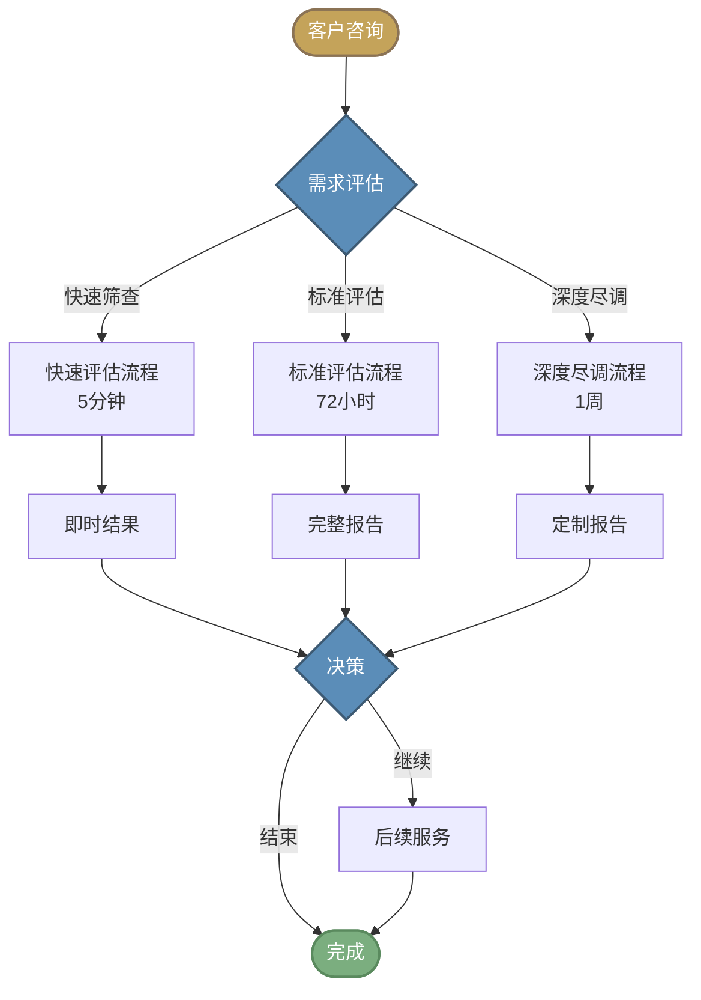

---

## 二、标准评估流程（72小时）

### 2.1 流程总览

```mermaid
flowchart LR
    subgraph T0["T+0小时"]
        A[需求确认] --> B[合同签署]
        B --> C[资料收集]
    end
    
    subgraph T24["T+24小时"]
        D[问卷发放] --> E[深度访谈]
        E --> F[数据录入]
    end
    
    subgraph T48["T+48小时"]
        G[7维度评分] --> H[案例匹配]
        H --> I[风险识别]
        I --> J[报告撰写]
    end
    
    subgraph T72["T+72小时"]
        K[质量审核] --> L[报告交付]
        L --> M[专家解读]
    end
    
    C --> D
    F --> G
    J --> K
    
    style A fill:#C4A35A,stroke:#8B7355,stroke-width:2px,color:#fff
    style D fill:#C4A35A,stroke:#8B7355,stroke-width:2px,color:#fff
    style G fill:#5B8DB8,stroke:#3D5A73,stroke-width:2px,color:#fff
    style K fill:#7BAE7F,stroke:#5A8A5E,stroke-width:2px,color:#fff
```

### 2.2 详细流程步骤

```mermaid
flowchart TB
    Start([客户下单]) --> Step1[Step1: 需求确认<br/>30分钟访谈]
    
    Step1 --> Step2[Step2: 合同签署<br/>确认服务范围]
    Step2 --> Step3[Step3: 资料收集<br/>候选人背景资料]
    
    Step3 --> Step4[Step4: 问卷发放<br/>18题评估问卷]
    Step4 --> Step5[Step5: 深度访谈<br/>60分钟结构化访谈]
    
    Step5 --> Step6[Step6: 数据录入<br/>系统录入评估数据]
    Step6 --> Step7[Step7: 7维度评分<br/>按权重计算得分]
    
    Step7 --> Step8[Step8: 案例匹配<br/>匹配相似案例]
    Step8 --> Step9[Step9: 风险识别<br/>红黄蓝信号识别]
    
    Step9 --> Step10[Step10: 报告撰写<br/>生成完整报告]
    Step10 --> Step11[Step11: 质量审核<br/>专家审核报告]
    
    Step11 --> Step12[Step12: 报告交付<br/>PDF+HTML+解读]
    Step12 --> Step13[Step13: 专家解读<br/>30分钟解读会]
    
    Step13 --> End([完成])
    
    style Start fill:#C4A35A,stroke:#8B7355,stroke-width:2px,color:#fff
    style End fill:#7BAE7F,stroke:#5A8A5E,stroke-width:2px,color:#fff
    style Step1 fill:#E8E8E8,stroke:#B8B8B8,stroke-width:2px,color:#333
    style Step5 fill:#5B8DB8,stroke:#3D5A73,stroke-width:2px,color:#fff
    style Step7 fill:#5B8DB8,stroke:#3D5A73,stroke-width:2px,color:#fff
    style Step13 fill:#C4A35A,stroke:#8B7355,stroke-width:2px,color:#fff
```

---

## 三、评估执行流程

### 3.1 数据采集流程

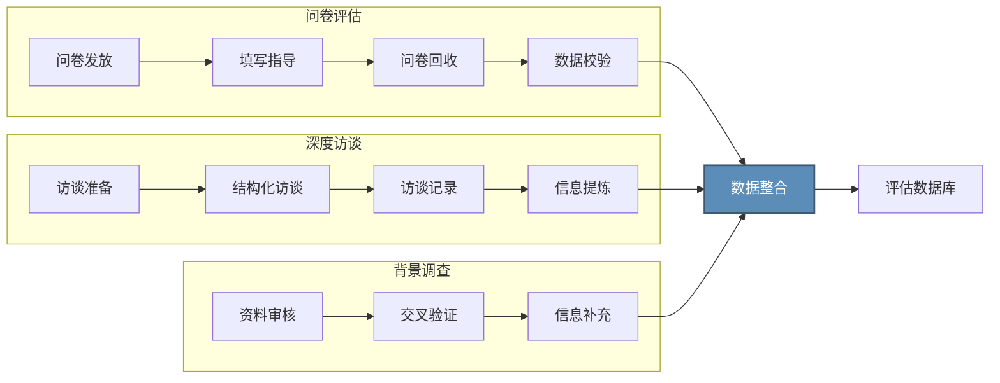

### 3.2 7维度评分流程

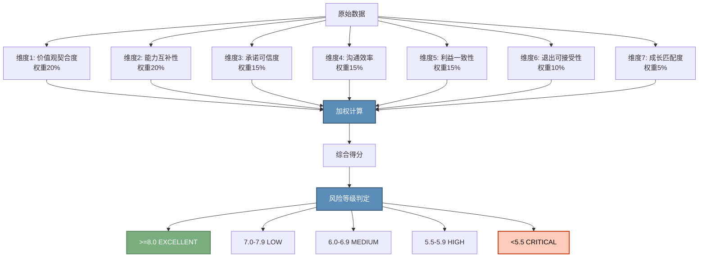

### 3.3 案例匹配流程

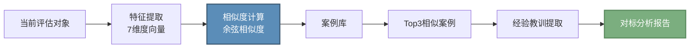

---

## 四、报告生成流程

### 4.1 报告组装流程

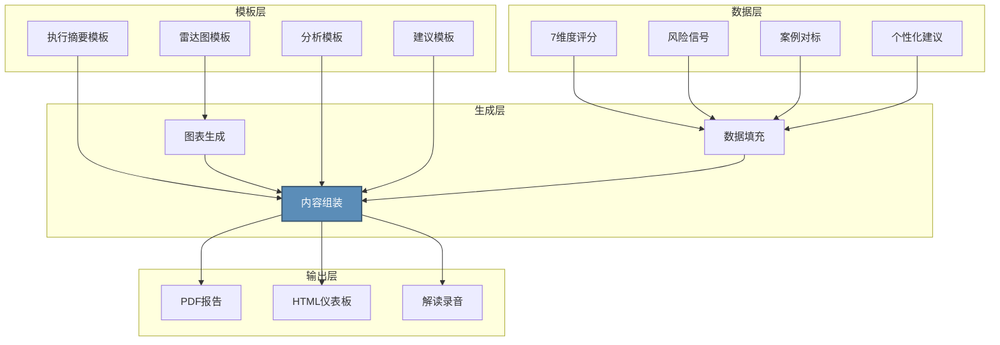

---

## 五、客户旅程地图

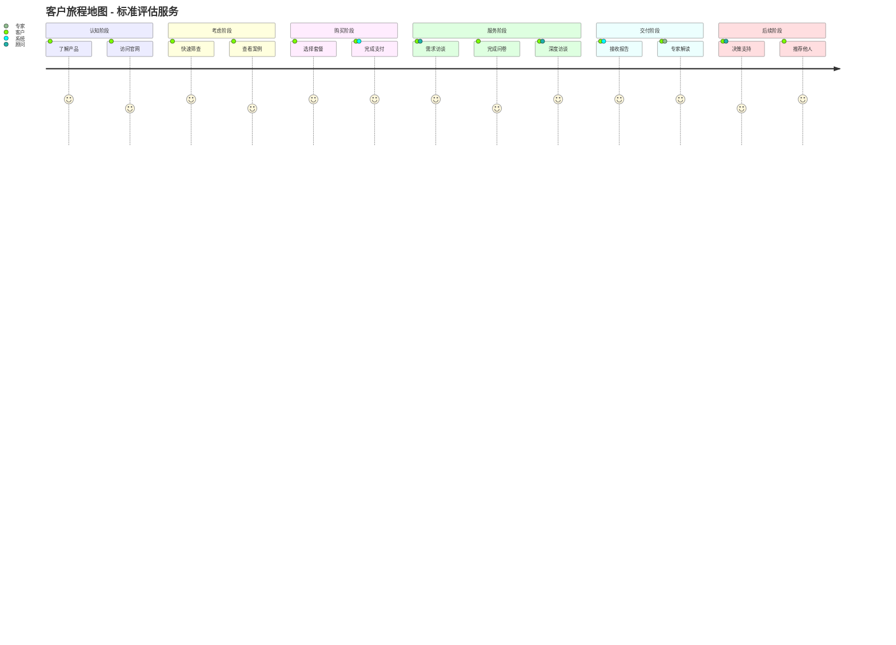

---

## 六、质量管控流程

### 6.1 报告审核流程

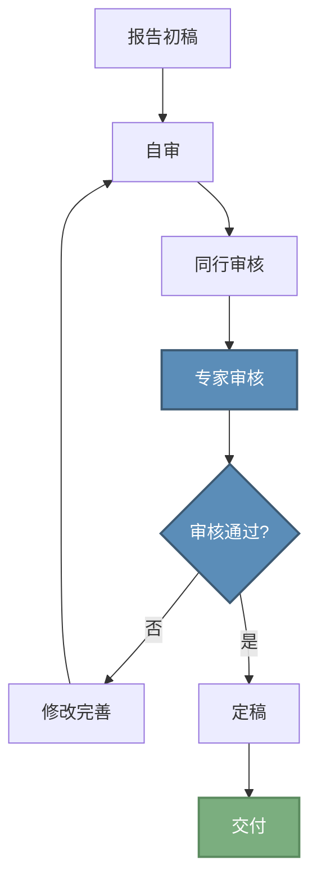

### 6.2 质量检查清单

| 检查项 | 检查内容 | 责任人 |
|--------|----------|--------|
| 数据准确性 | 评分计算是否正确 | 分析师 |
| 逻辑一致性 | 分析与结论是否一致 | 同行 |
| 专业性 | 术语使用、分析深度 | 专家 |
| 完整性 | 所有承诺内容是否交付 | PM |
| 时效性 | 是否在72小时内交付 | PM |

---

## 七、异常处理流程

### 7.1 延期处理流程

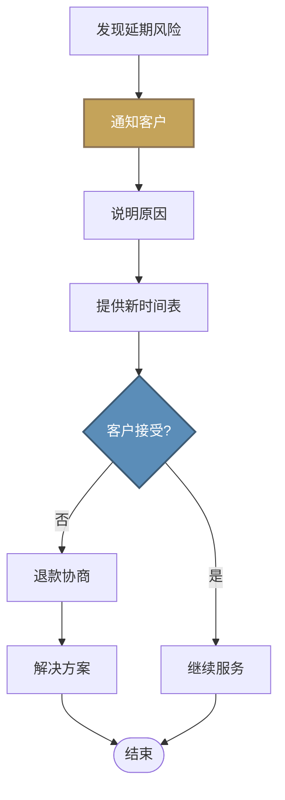

### 7.2 客户投诉处理流程

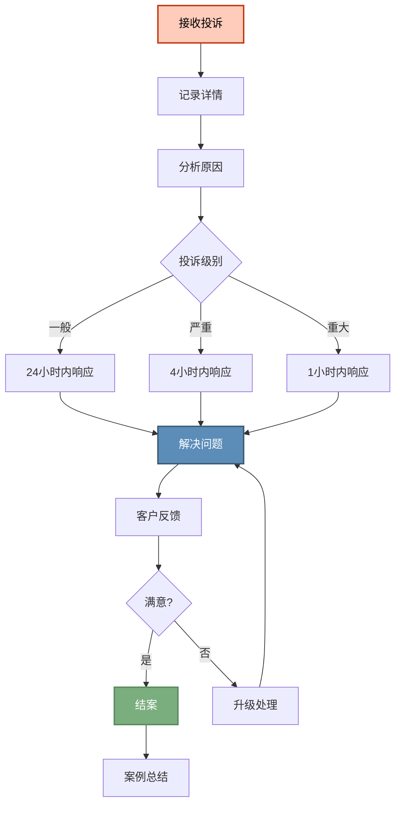

---

## 八、后续服务流程

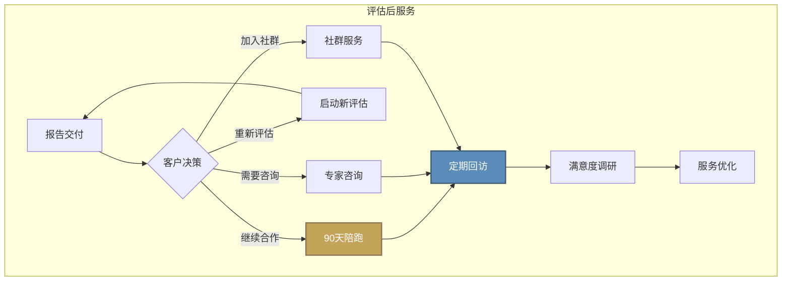

---

**文档信息**

| 项目 | 内容 |
|------|------|
| 文档名称 | 满意解合伙人评估服务 · 服务流程图V1.0 |
| 版本号 | V1.0 |
| 发布日期 | 2026年3月25日 |
| 所属组织 | 满意解研究所 |

---

*本文档版权归满意解研究所所有*
