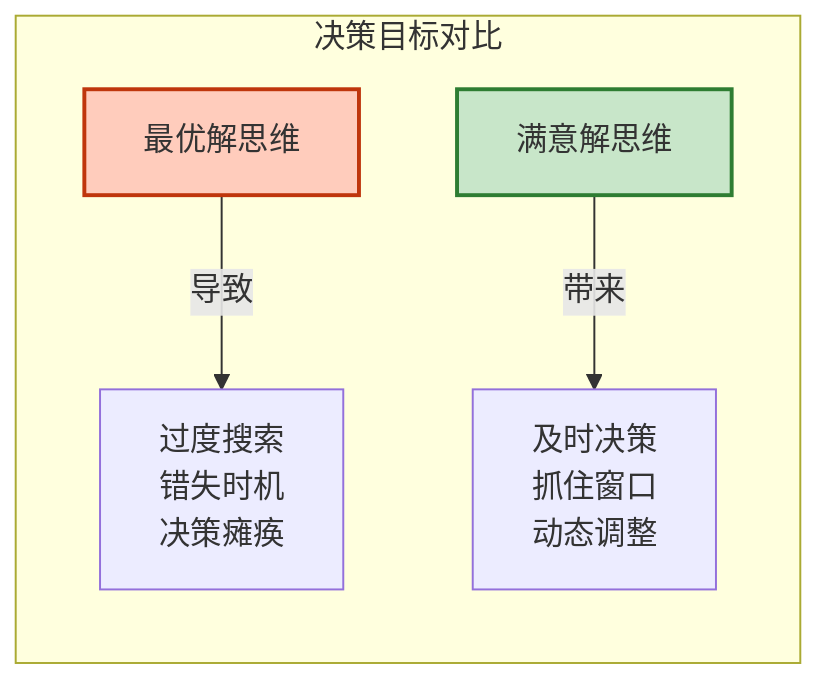
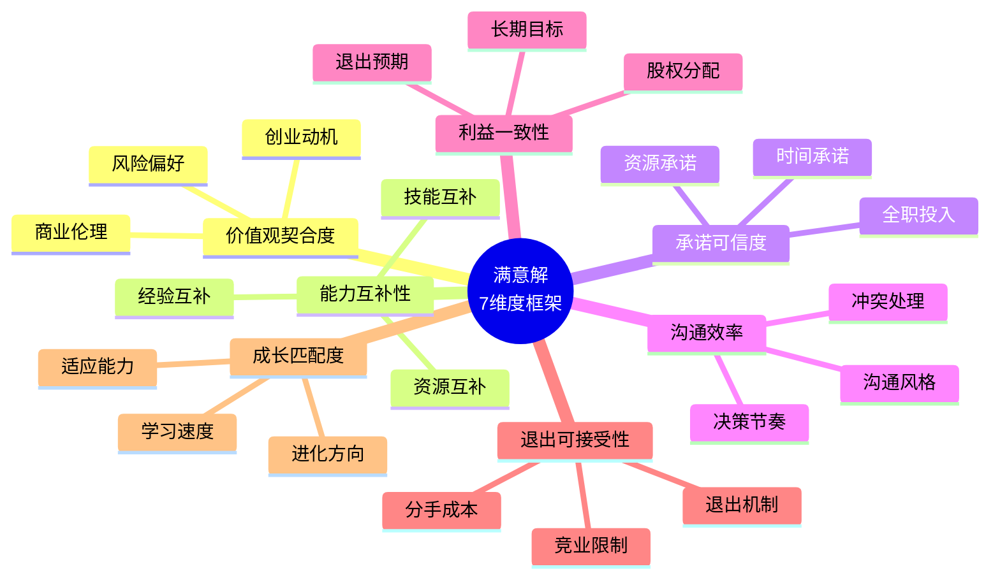
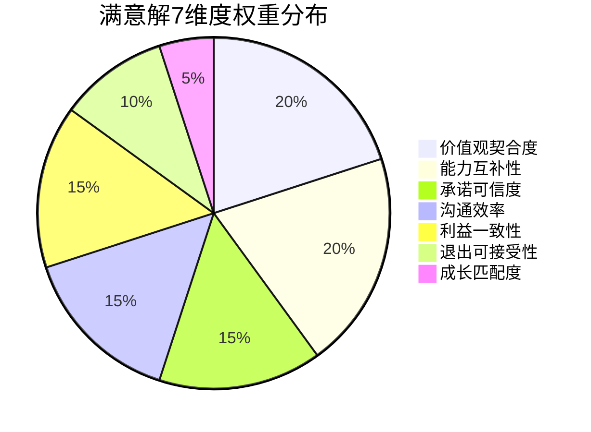
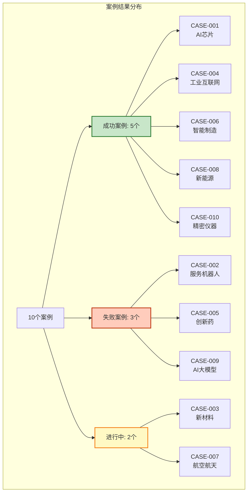
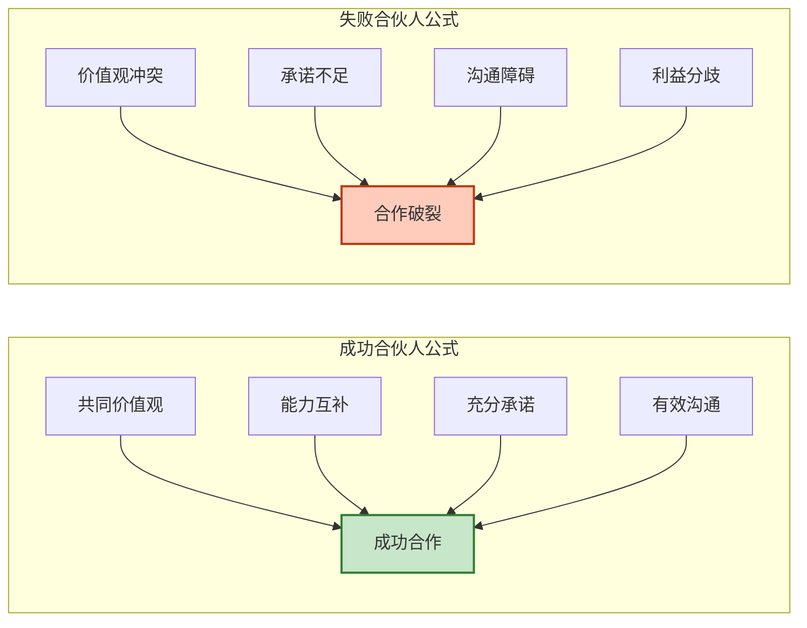
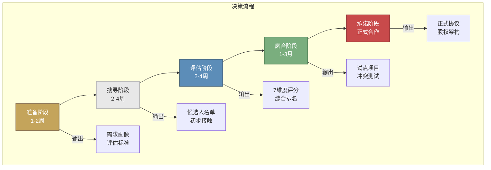
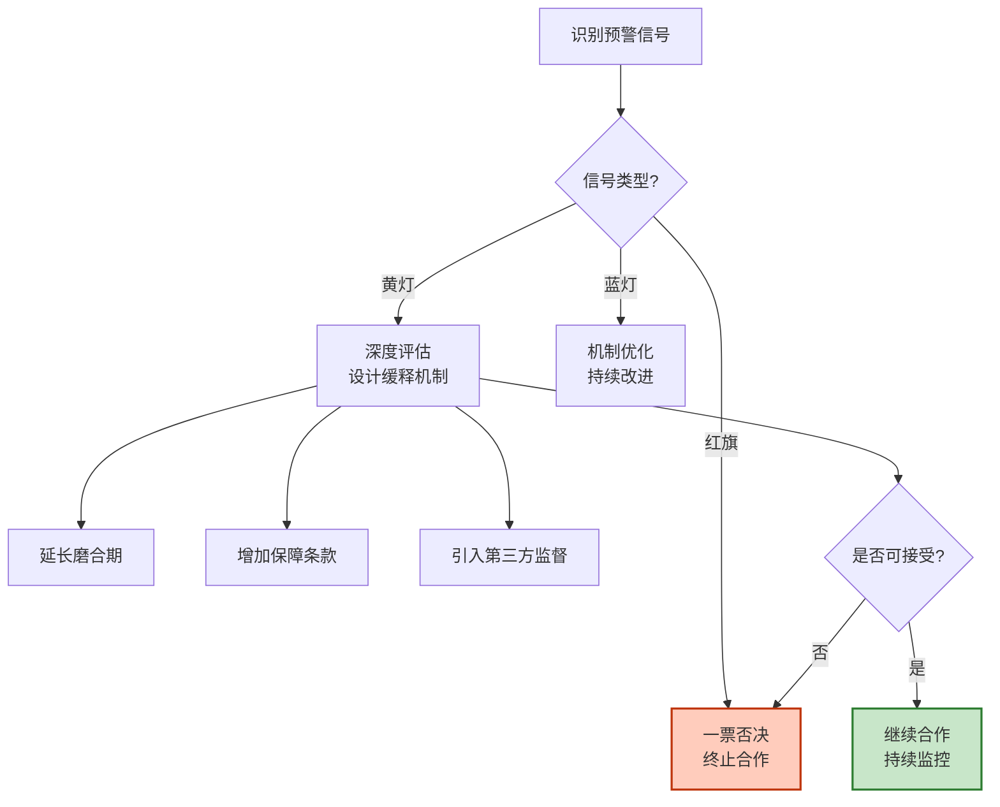

# 合伙人匹配决策方法论 V1.0

**基于满意解理论的硬件初创企业合伙人选择决策框架**

---

<div align="center">

**满意解研究所 · 白皮书**

*2026年3月*

</div>

---

## 摘要

在硬科技创业领域，合伙人的选择往往比商业模式更能决定企业的生死存亡。本白皮书基于满意解研究所对10个真实案例的深度研究，结合赫伯特·西蒙的满意解决策理论，提出了一套专门针对硬件初创企业家的合伙人匹配决策方法论。

研究发现：成功的合伙人匹配并非寻找"最优解"，而是在有限信息和时间压力下，找到满足核心标准的"满意解"。本方法论从7个维度构建评估体系，帮助创业者系统化地识别、评估和选择合伙人，降低决策风险，提高匹配成功率。

**关键词**：合伙人匹配、满意解、硬件创业、决策科学、风险评估

---

## 目录

1. [引言：为什么选择合伙人如此重要](#一引言为什么选择合伙人如此重要)
2. [理论基础：满意解决策科学](#二理论基础满意解决策科学)
3. [满意解7维度评估框架](#三满意解7维度评估框架)
4. [10案例实证研究](#四十案例实证研究)
5. [实操指南：评估工具与流程](#五实操指南评估工具与流程)
6. [风险预警信号手册](#六风险预警信号手册)
7. [附录：工具模板与速查表](#七附录工具模板与速查表)

---

## 一、引言：为什么选择合伙人如此重要

### 1.1 硬科技创业的特殊性

硬科技创业与其他领域有着本质区别：

- **长周期**：从研发到量产通常需要3-5年
- **高投入**：需要持续的资金、人才和技术投入
- **高风险**：技术路线、市场验证、供应链等环节都可能失败
- **强依赖**：合伙人之间的互补性是企业核心竞争力的来源

### 1.2 合伙人匹配的痛点

基于对硬件初创企业家的深度访谈，我们发现合伙人在选择过程中面临以下核心痛点：

| 痛点 | 描述 | 后果 |
|------|------|------|
| 信息不对称 | 短期内难以全面了解对方的能力和品格 | 合作后才发现不匹配 |
| 时间压力 | 融资窗口、市场机会要求快速决策 | 仓促决定，事后后悔 |
| 认知偏差 | 被光环效应、相似性偏见误导 | 忽视了关键风险信号 |
| 缺乏框架 | 凭直觉和经验判断，缺乏系统性 | 遗漏重要评估维度 |
| 退出困难 | 一旦合作，退出成本极高 | 陷入痛苦合作或高额分手费 |

### 1.3 满意解：一个更现实的决策目标

传统决策理论追求"最优解"，但在现实中，创业者面临的是**有限理性**（Bounded Rationality）的约束：

- 无法获得全部信息
- 认知能力有限
- 时间压力
- 未来不确定性

赫伯特·西蒙提出的**满意解（Satisficing）**原则指出：决策者应设定一个可调整的渴望水平，一旦遇到超过该水平的备选方案就结束搜索。

**核心洞见**：合伙人匹配不是寻找"完美伴侣"，而是找到"足够好"且"可持续"的合作伙伴。



---

## 二、理论基础：满意解决策科学

### 2.1 赫伯特·西蒙的决策理论

赫伯特·西蒙（Herbert A. Simon，1916-2001）是决策科学领域的奠基人，1978年诺贝尔经济学奖获得者。他的核心理论对合伙人匹配决策具有重要指导意义：

#### 2.1.1 有限理性（Bounded Rationality）

> "企业决策者并不拥有'完全理性'，而只有'有限理性'；他们不再追求'最优'，而只追求'满意'。"

**在合伙人匹配中的应用**：
- 接受信息不对称的现实
- 设计机制降低信息获取成本
- 在关键维度上设定最低接受标准

#### 2.1.2 满意解原则（Satisficing）

> "设定一个可调整的渴望水平，一旦遇到超过该水平的备选方案就结束搜索。"

**合伙人匹配中的渴望水平设定**：
- 价值观契合度：≥7分（满分10分）
- 能力互补性：≥8分
- 承诺可信度：≥7分
- 利益一致性：≥6分

#### 2.1.3 决策四阶段论

| 阶段 | 西蒙术语 | 合伙人匹配对应 | 关键动作 |
|------|----------|----------------|----------|
| 1 | 情报活动 | 需求澄清访谈 | 明确自身需求和标准 |
| 2 | 设计活动 | 候选人深度访谈 | 开发评估备选方案 |
| 3 | 抉择活动 | 最终决策会 | 选择并确定合作意向 |
| 4 | 审查活动 | 90天陪跑 | 评估并调整合作关系 |


### 2.2 合伙人匹配的决策类型

合伙人引入属于**非程序化决策**（Non-programmed Decision）：
- 无固定规则可循
- 需要创造性解决方案
- 结果影响深远且不可逆

**服务价值**：将非程序化决策转化为可复用的评估框架，提高决策质量和效率。

---

## 三、满意解7维度评估框架

### 3.1 框架总览

基于10个案例的实证研究和西蒙决策理论，我们构建了合伙人匹配的**7维度满意解评估框架**：



### 3.2 维度详解

#### 维度1：价值观契合度（Weight: 20%）

**定义**：双方在创业动机、风险偏好、商业伦理等核心价值观上的一致程度。

**评估要点**：
| 子维度 | 关键问题 | 评分标准 |
|--------|----------|----------|
| 创业动机 | 为什么创业？财富/理想/成就？ | 是否一致或互补而非冲突 |
| 风险偏好 | 对不确定性的容忍度 | 是否在同一量级 |
| 商业伦理 | 底线和原则 | 是否存在根本冲突 |
| 时间观 | 短期vs长期导向 | 是否能调和 |

**案例洞察**：
- **CASE-001（成功）**：技术方和商业方都对AI芯片国产替代有使命感，价值观高度契合（9分）
- **CASE-002（失败）**：技术方追求技术极致，资本方追求短期回报，价值观严重冲突（2分）

#### 维度2：能力互补性（Weight: 20%）

**定义**：双方在技能、经验、资源上的互补程度。

**评估要点**：
| 子维度 | 关键问题 | 评分标准 |
|--------|----------|----------|
| 技能互补 | 技术/商业/运营/资本的覆盖 | 是否形成完整闭环 |
| 经验互补 | 产业经验vs学术背景 | 是否能互相补充 |
| 资源互补 | 客户/供应链/资金/人才 | 是否能互相借力 |

**案例洞察**：
- **CASE-004（成功）**：连续创业者（商业）+ 平台架构师（技术），能力高度互补（9分）
- **CASE-003（进行中）**：科学家（技术）+ 企业家（商业），能力强但磨合中（9分）

#### 维度3：承诺可信度（Weight: 15%）

**定义**：对方对全职投入、时间精力、资源投入的承诺及其可信程度。

**评估要点**：
| 子维度 | 关键问题 | 评分标准 |
|--------|----------|----------|
| 全职投入 | 能否全职加入？何时？ | 是否有明确时间表 |
| 时间承诺 | 每周能投入多少时间？ | 是否与创业需求匹配 |
| 资源承诺 | 能带来什么资源？ | 是否可验证 |

**案例洞察**：
- **CASE-009（失败）**：科学家希望保留教职，CEO要求全职，无法达成一致（3分）
- **CASE-010（成功）**：明确all-in时间表，销售方按时全职加入（9分）

#### 维度4：沟通效率（Weight: 15%）

**定义**：双方沟通风格、决策节奏、冲突处理方式的匹配程度。

**评估要点**：
| 子维度 | 关键问题 | 评分标准 |
|--------|----------|----------|
| 沟通风格 | 直接vs委婉，书面vs口头 | 是否能互相适应 |
| 决策节奏 | 快速vs谨慎，数据vs直觉 | 是否能找到平衡点 |
| 冲突处理 | 面对分歧的方式 | 是否能建设性解决 |

**案例洞察**：
- **CASE-005（失败）**：海归习惯邮件，本土CEO习惯微信，沟通成本极高（3分）
- **CASE-010（成功）**：5年前同事，沟通默契，效率高（9分）

#### 维度5：利益一致性（Weight: 15%）

**定义**：双方在股权分配、退出预期、长期目标上的一致性。

**评估要点**：
| 子维度 | 关键问题 | 评分标准 |
|--------|----------|----------|
| 股权分配 | 对贡献和价值的认知 | 是否认可分配方案 |
| 退出预期 | IPO/并购/长期持有？ | 是否一致 |
| 长期目标 | 5-10年的愿景 | 是否同向 |

**案例洞察**：
- **CASE-001（成功）**：引入第三方顾问，按贡献重新设计股权（7分）
- **CASE-007（进行中）**：体制内vs市场化思路，利益分配仍在磨合（5分）

#### 维度6：退出可接受性（Weight: 10%）

**定义**：如果合作失败，退出机制的设计和双方对分手成本的可接受程度。

**评估要点**：
| 子维度 | 关键问题 | 评分标准 |
|--------|----------|----------|
| 退出机制 | 是否有预设的退出条款 | 是否明确且合理 |
| 分手成本 | 时间/资金/声誉损失 | 是否在可承受范围 |
| 竞业限制 | 退出后的限制 | 是否公平且可执行 |

**案例洞察**：
- **CASE-002（失败）**：价值观冲突导致分手，双方损失巨大（5分）
- **CASE-009（失败）**：科学家回归学术界，退出相对平和（8分）

#### 维度7：成长匹配度（Weight: 5%）

**定义**：双方学习速度、适应能力、进化方向的匹配程度。

**评估要点**：
| 子维度 | 关键问题 | 评分标准 |
|--------|----------|----------|
| 学习速度 | 吸收新知识的效率 | 是否相近 |
| 适应能力 | 面对变化的调整 | 是否灵活 |
| 进化方向 | 个人成长目标 | 是否兼容 |

**案例洞察**：
- **CASE-008（成功）**：海归CTO主动学习本土环境，CEO给予耐心（8分）
- **CASE-005（失败）**：双方固守原有模式，无法互相适应（4分）

### 3.3 维度权重说明



**权重设计逻辑**：
1. **价值观契合度**（20%）：长期合作的基石，冲突会导致根本性分裂
2. **能力互补性**（20%）：创业成功的必要条件，但不足以保证合作成功
3. **承诺可信度**（15%）：硬件创业需要长期投入，兼职难以成功
4. **沟通效率**（15%）：日常合作的润滑剂，低效沟通会消耗大量精力
5. **利益一致性**（15%）：合作动力的保障，但可以通过机制设计调整
6. **退出可接受性**（10%）：风险控制的底线，必须提前考虑
7. **成长匹配度**（5%）：锦上添花，创业早期相对次要

### 3.4 满意解评分标准

```
┌─────────────────────────────────────────────────────────────┐
│                    满意解评分标准                            │
├─────────────────────────────────────────────────────────────┤
│                                                             │
│   8.0-10分  【优秀】  强烈推荐合作                          │
│            该维度表现优异，是合伙人的核心优势               │
│                                                             │
│   6.0-7.9分 【良好】  可以合作，需关注                      │
│            该维度基本满足要求，但需要持续优化               │
│                                                             │
│   4.0-5.9分 【及格】  谨慎合作，有风险                      │
│            该维度存在明显问题，需要设计补偿机制             │
│                                                             │
│   0-3.9分   【不合格】不建议合作                            │
│            该维度存在根本性缺陷，合作风险极高               │
│                                                             │
└─────────────────────────────────────────────────────────────┘
```

**综合评估阈值**：
- **加权总分 ≥ 7.0**：推荐合作
- **加权总分 5.5-6.9**：谨慎合作，需设计风险缓释机制
- **加权总分 < 5.5**：不建议合作

**单项否决原则**：
- 价值观契合度 < 5分：一票否决
- 承诺可信度 < 4分：一票否决

---

## 四、10案例实证研究

### 4.1 案例总览

基于对10个硬件初创企业合伙人匹配案例的深度研究，我们总结了成功和失败的关键模式：



### 4.2 成功案例共性分析

**5个成功案例的7维度评分**：

| 案例 | 价值观 | 能力 | 承诺 | 沟通 | 利益 | 退出 | 成长 | 加权总分 |
|------|--------|------|------|------|------|------|------|----------|
| CASE-001 | 9 | 9 | 8 | 8 | 7 | 7 | 8 | **8.15** |
| CASE-004 | 8 | 9 | 9 | 8 | 8 | 7 | 8 | **8.35** |
| CASE-006 | 9 | 9 | 9 | 8 | 8 | 8 | 8 | **8.60** |
| CASE-008 | 9 | 9 | 8 | 8 | 8 | 7 | 8 | **8.35** |
| CASE-010 | 8 | 9 | 9 | 9 | 8 | 8 | 8 | **8.55** |

**成功案例的共同特征**：

1. **价值观契合度 ≥ 8分**：所有成功案例在价值观上都高度一致
2. **能力互补性 ≥ 9分**：成功合伙都具有极强的互补性
3. **承诺可信度 ≥ 8分**：成功合伙都做到了全职、全身心投入
4. **加权总分 ≥ 8.0**：成功案例的综合评分均在优秀区间

**关键成功因素**：

| 因素 | 说明 | 典型案例 |
|------|------|----------|
| 前同事/老友关系 | 已有信任基础，降低磨合成本 | CASE-010 |
| 明确的决策权划分 | 技术/商业边界清晰，减少冲突 | CASE-001, CASE-004 |
| 第三方顾问介入 | 股权分配等敏感问题外部化 | CASE-001 |
| 共同的行业背景 | 语言、认知、人脉高度重叠 | CASE-006 |
| 海归本土化支持 | 本土合伙人给予耐心和资源支持 | CASE-008 |

### 4.3 失败案例教训分析

**3个失败案例的7维度评分**：

| 案例 | 价值观 | 能力 | 承诺 | 沟通 | 利益 | 退出 | 成长 | 加权总分 |
|------|--------|------|------|------|------|------|------|----------|
| CASE-002 | 2 | 7 | 4 | 3 | 2 | 5 | 3 | **3.35** |
| CASE-005 | 4 | 8 | 5 | 3 | 4 | 4 | 4 | **4.65** |
| CASE-009 | 5 | 8 | 3 | 5 | 4 | 8 | 3 | **5.00** |

**失败案例的共同特征**：

1. **价值观契合度 ≤ 5分**：价值观冲突是失败的根源
2. **沟通效率 ≤ 5分**：沟通不畅加速了关系的恶化
3. **承诺可信度低**：兼职、观望态度导致合作无法深入

**关键失败因素**：

| 因素 | 说明 | 典型案例 |
|------|------|----------|
| 短期主义vs长期主义 | 资本方追求快速回报，技术方坚持长期研发 | CASE-002 |
| 文化冲突 | 海归与本土在沟通方式、决策风格上的巨大差异 | CASE-005 |
| 学术明星陷阱 | 学术声誉不等于创业承诺和能力 | CASE-009 |
| 决策太快 | 蜜月期过短，没有充分了解就合作 | CASE-002 |
| 退出机制缺失 | 合作前未考虑分手方案，导致僵局 | CASE-005 |

### 4.4 关键洞察汇总



**10案例的核心洞察**：

1. **价值观是基石**：所有成功案例价值观契合度≥8分，所有失败案例≤5分
2. **能力互补必要但不充分**：CASE-002/005/009能力互补性都不低，但仍失败
3. **承诺是门槛**：全职投入是硬科技合伙的前提条件
4. **沟通效率决定体验**：低沟通效率会持续消耗合作热情
5. **退出机制必须前置**：合作前要考虑分手方案

---

## 五、实操指南：评估工具与流程

### 5.1 合伙人匹配决策流程



### 5.2 阶段1：准备阶段

**目标**：明确自身需求和评估标准

**关键动作**：
1. **自我评估**：明确自己的优势、短板、需求和底线
2. **岗位画像**：定义合伙人角色、职责、能力要求
3. **标准设定**：设定7维度的最低接受分数（渴望水平）

**工具：自我评估清单**

```markdown
## 创始人自我评估

### 1. 我的核心优势
- [ ] 技术能力
- [ ] 商业洞察
- [ ] 运营执行
- [ ] 资源网络
- [ ] 融资能力

### 2. 我的关键短板
- [ ] 技术能力不足
- [ ] 商业经验欠缺
- [ ] 管理能力待提升
- [ ] 行业资源有限
- [ ] 其他：________

### 3. 我需要合伙人带来的
- [ ] 技术/研发能力
- [ ] 商业/市场能力
- [ ] 运营/管理能力
- [ ] 资金/资源
- [ ] 行业经验

### 4. 我的底线
- [ ] 最低股权比例：____%
- [ ] 最大可接受损失：____万
- [ ] 最晚退出时间：____年
```

**工具：渴望水平设定表**

| 维度 | 最低接受分 | 理想分数 | 权重 |
|------|------------|----------|------|
| 价值观契合度 | 7 | 9 | 20% |
| 能力互补性 | 8 | 9 | 20% |
| 承诺可信度 | 7 | 9 | 15% |
| 沟通效率 | 6 | 8 | 15% |
| 利益一致性 | 6 | 8 | 15% |
| 退出可接受性 | 6 | 8 | 10% |
| 成长匹配度 | 5 | 7 | 5% |

### 5.3 阶段2：搜寻阶段

**目标**：扩大候选人池，进行初步筛选

**关键动作**：
1. **多渠道搜寻**：校友网络、行业活动、投资人推荐、猎头
2. **初步接触**：非正式会面，了解背景和意向
3. **快速筛选**：使用简化版评估表排除明显不匹配者

**工具：初步筛选清单**

| 检查项 | 是 | 否 | 备注 |
|--------|----|----|------|
| 愿意全职投入创业？ | | | |
| 对行业有热情和认知？ | | | |
| 背景和技能与我有互补性？ | | | |
| 沟通顺畅，无重大障碍？ | | | |
| 没有明显的价值观冲突？ | | | |
| 愿意接受合理的股权比例？ | | | |

**通过标准**：至少5项为"是"

### 5.4 阶段3：评估阶段

**目标**：对候选人进行7维度深度评估

**关键动作**：
1. **深度访谈**：结构化访谈，覆盖7维度
2. **背景调查**：核实经历、能力、人品
3. **情景测试**：模拟合作场景，观察反应
4. **评分记录**：使用标准化评分表

**工具：7维度深度评估访谈指南**

```markdown
## 维度1：价值观契合度访谈

1. "你为什么想创业？10年后你希望自己处于什么位置？"
2. "如果公司有100万利润，你会怎么分配？"
3. "描述一个你拒绝过的商业机会，为什么拒绝？"
4. "你对'成功'的定义是什么？"

## 维度2：能力互补性访谈

1. "请详细介绍你过去最有成就感的3个项目"
2. "你认为这个行业的关键成功因素是什么？"
3. "你有哪些独特的资源或网络可以带入公司？"
4. "你最不擅长什么？希望谁来补足？"

## 维度3：承诺可信度访谈

1. "你目前的工作状态？什么时候可以全职加入？"
2. "你的家庭对你创业的态度？"
3. "你的财务储备能支撑多久的创业生活？"
4. "如果12个月内没有收入，你会怎么办？"

## 维度4：沟通效率访谈

1. "描述你做决策的典型过程"
2. "当你不同意对方的观点时，通常会怎么处理？"
3. "你喜欢什么样的沟通方式？（频率/渠道/风格）"
4. "举一个你成功解决冲突的例子"

## 维度5：利益一致性访谈

1. "你对股权分配的期望和逻辑是什么？"
2. "你希望公司5年后达到什么状态？"
3. "你的理想退出方式是什么？IPO/并购/长期持有？"
4. "如果公司被收购，你会怎么选择？"

## 维度6：退出可接受性访谈

1. "如果合作不顺利，你希望的退出机制是什么？"
2. "你能接受的最低分手成本是什么？"
3. "退出后你对竞业限制的看法？"
4. "你之前有没有过合伙失败的经历？怎么处理的？"

## 维度7：成长匹配度访谈

1. "你最近一年学到了什么新东西？"
2. "当环境发生剧变时，你通常怎么适应？"
3. "你未来3年的个人成长目标是什么？"
4. "你希望从这个合伙关系中获得什么成长？"
```

**工具：7维度评分表**

| 维度 | 权重 | 评分(1-10) | 加权分 | 关键证据 |
|------|------|------------|--------|----------|
| 价值观契合度 | 20% | | | |
| 能力互补性 | 20% | | | |
| 承诺可信度 | 15% | | | |
| 沟通效率 | 15% | | | |
| 利益一致性 | 15% | | | |
| 退出可接受性 | 10% | | | |
| 成长匹配度 | 5% | | | |
| **总计** | **100%** | - | | |

### 5.5 阶段4：磨合阶段

**目标**：通过试点合作验证匹配度

**关键动作**：
1. **设定试点项目**：3个月内的具体合作任务
2. **高频复盘**：每周沟通，每月深度复盘
3. **冲突测试**：刻意创造一些分歧，观察处理方式
4. **动态评估**：更新7维度评分

**工具：磨合期复盘模板**

```markdown
## 磨合期复盘（第___周/月）

### 1. 本周/月的主要进展
- 

### 2. 合作中的亮点
- 

### 3. 遇到的挑战或分歧
- 

### 4. 分歧的处理方式和结果
- 

### 5. 7维度评分更新
| 维度 | 初始评分 | 当前评分 | 变化原因 |
|------|----------|----------|----------|
| 价值观契合度 | | | |
| 能力互补性 | | | |
| 承诺可信度 | | | |
| 沟通效率 | | | |
| 利益一致性 | | | |
| 退出可接受性 | | | |
| 成长匹配度 | | | |

### 6. 是否继续合作的决策
- [ ] 继续推进到下一阶段
- [ ] 延长磨合期，观察以下方面：______
- [ ] 终止合作，原因：______
```

### 5.6 阶段5：承诺阶段

**目标**：正式确定合作关系，签署协议

**关键动作**：
1. **股权架构设计**：基于贡献和预期的合理分配
2. **治理机制设计**：决策权、分工、监督机制
3. **退出机制设计**：预设分手方案，降低退出成本
4. **法律协议签署**：股东协议、竞业限制、保密协议

**工具：股权分配参考框架**

```
┌─────────────────────────────────────────────────────────────┐
│                    股权分配参考原则                          │
├─────────────────────────────────────────────────────────────┤
│                                                             │
│  1. 创始团队总股权：建议70-80%                              │
│     - 预留10-20%给未来团队                                  │
│     - 预留10-20%给期权池                                    │
│                                                             │
│  2. 双创始人分配参考：                                      │
│     - 均衡型：45% : 45% + 10%期权池                        │
│     - 主导型：60% : 25% + 15%期权池                        │
│     - 动态型：50% : 30% + 20%（含对赌）                    │
│                                                             │
│  3. 分配依据：                                              │
│     - 已投入资源（时间/资金/IP）                           │
│     - 预期贡献（未来3-5年）                                │
│     - 不可替代性                                            │
│     - 风险承担能力                                          │
│                                                             │
└─────────────────────────────────────────────────────────────┘
```

---

## 六、风险预警信号手册

### 6.1 红旗信号：一票否决项

出现以下任一信号，建议终止合作考虑：

| 信号 | 说明 | 案例 |
|------|------|------|
| **价值观根本冲突** | 在商业伦理、创业动机上存在不可调和的分歧 | CASE-002：技术vs资本的根本对立 |
| **不愿全职投入** | 希望兼职、保留退路或观望 | CASE-009：科学家坚持保留教职 |
| **隐瞒关键信息** | 对过往经历、资源承诺、家庭支持等关键信息隐瞒或造假 | - |
| **有竞业限制风险** | 与前雇主存在竞业限制纠纷风险 | - |
| **法律/信用污点** | 有失信记录、诉讼纠纷、道德污点 | - |

### 6.2 黄灯信号：需要深度关注

出现以下信号，需要设计风险缓释机制：

| 信号 | 风险 | 应对策略 |
|------|------|----------|
| **沟通风格差异大** | 日常协作效率低 | 建立标准化沟通机制 |
| **工作节奏不一致** | 项目推进困难 | 明确里程碑和交付标准 |
| **股权期望差距大** | 利益分配僵局 | 引入第三方顾问，动态股权设计 |
| **退出预期不一致** | 长期目标分歧 | 明确退出触发条件和机制 |
| **家庭支持不足** | 承诺可信度存疑 | 与家人会面，确认支持度 |
| **财务储备不足** | 短期压力影响决策 | 设计过桥资金支持方案 |

### 6.3 蓝灯信号：可以优化改进

出现以下信号，可以通过机制设计优化：

| 信号 | 优化方向 |
|------|----------|
| 决策流程不清晰 | 建立决策矩阵，明确各自决策权 |
| 会议效率不高 | 设定议程规则，限时发言 |
| 信息同步不及时 | 建立周报/日报机制 |
| 反馈方式不习惯 | 约定反馈方式（书面/口头/即时/延迟） |

### 6.4 风险预警流程



---

## 七、附录：工具模板与速查表

### 附录A：7维度评分速查表

```
┌──────────────────────────────────────────────────────────────────────────┐
│                        7维度评分速查表                                    │
├──────────────┬─────────────┬─────────────┬─────────────┬─────────────────┤
│    维度      │   权重      │  最低要求   │  理想分数   │   评分要点      │
├──────────────┼─────────────┼─────────────┼─────────────┼─────────────────┤
│ 价值观契合度 │    20%      │    ≥ 7      │    9-10     │ 创业动机、风险  │
│              │             │             │             │ 偏好、商业伦理  │
├──────────────┼─────────────┼─────────────┼─────────────┼─────────────────┤
│ 能力互补性   │    20%      │    ≥ 8      │    9-10     │ 技能、经验、    │
│              │             │             │             │ 资源互补        │
├──────────────┼─────────────┼─────────────┼─────────────┼─────────────────┤
│ 承诺可信度   │    15%      │    ≥ 7      │    9-10     │ 全职投入、      │
│              │             │             │             │ 时间/资源承诺   │
├──────────────┼─────────────┼─────────────┼─────────────┼─────────────────┤
│ 沟通效率     │    15%      │    ≥ 6      │    8-10     │ 沟通风格、      │
│              │             │             │             │ 决策节奏        │
├──────────────┼─────────────┼─────────────┼─────────────┼─────────────────┤
│ 利益一致性   │    15%      │    ≥ 6      │    8-10     │ 股权分配、      │
│              │             │             │             │ 退出预期        │
├──────────────┼─────────────┼─────────────┼─────────────┼─────────────────┤
│ 退出可接受性 │    10%      │    ≥ 6      │    8-10     │ 退出机制、      │
│              │             │             │             │ 分手成本        │
├──────────────┼─────────────┼─────────────┼─────────────┼─────────────────┤
│ 成长匹配度   │     5%      │    ≥ 5      │    7-10     │ 学习能力、      │
│              │             │             │             │ 适应速度        │
├──────────────┼─────────────┼─────────────┼─────────────┼─────────────────┤
│ 综合阈值     │   100%      │   ≥ 7.0     │   ≥ 8.0     │                 │
└──────────────┴─────────────┴─────────────┴─────────────┴─────────────────┘
```

### 附录B：合伙人匹配决策检查清单

#### 准备阶段
- [ ] 完成自我评估
- [ ] 明确岗位画像
- [ ] 设定渴望水平
- [ ] 准备评估工具

#### 搜寻阶段
- [ ] 多渠道发布需求
- [ ] 至少接触5个候选人
- [ ] 完成初步筛选
- [ ] 确定深度评估名单（2-3人）

#### 评估阶段
- [ ] 完成7维度深度访谈
- [ ] 进行背景调查
- [ ] 完成情景测试
- [ ] 评分并记录证据
- [ ] 通过综合阈值判断

#### 磨合阶段
- [ ] 设计试点项目
- [ ] 设定磨合期（1-3月）
- [ ] 每周沟通复盘
- [ ] 更新7维度评分
- [ ] 做出继续/终止决策

#### 承诺阶段
- [ ] 设计股权架构
- [ ] 设计治理机制
- [ ] 设计退出机制
- [ ] 签署法律协议
- [ ] 设定90天跟踪计划

### 附录C：典型案例速览

| 案例 | 行业 | 结果 | 核心成功/失败因素 | 7维度总分 |
|------|------|------|-------------------|-----------|
| CASE-001 | AI芯片 | ✅ 成功 | 价值观契合+第三方顾问 | 8.15 |
| CASE-002 | 机器人 | ❌ 失败 | 价值观冲突+决策太快 | 3.35 |
| CASE-003 | 新材料 | 🔄 进行中 | 能力强但磨合中 | - |
| CASE-004 | 物联网 | ✅ 成功 | 决策权清晰划分 | 8.35 |
| CASE-005 | 生物医药 | ❌ 失败 | 文化冲突+沟通障碍 | 4.65 |
| CASE-006 | 智能制造 | ✅ 成功 | 工程师双创始人默契 | 8.60 |
| CASE-007 | 航空航天 | 🔄 进行中 | 体制内外文化碰撞 | - |
| CASE-008 | 新能源 | ✅ 成功 | 海归本土化成功 | 8.35 |
| CASE-009 | AI大模型 | ❌ 失败 | 学术明星陷阱 | 5.00 |
| CASE-010 | 精密仪器 | ✅ 成功 | 前同事信任基础 | 8.55 |

### 附录D：术语表

| 术语 | 定义 |
|------|------|
| 满意解（Satisficing） | 西蒙提出的决策原则，设定渴望水平，超过即停止搜索 |
| 有限理性（Bounded Rationality） | 决策者受信息、认知、时间限制，无法做到完全理性 |
| 7维度框架 | 价值观、能力、承诺、沟通、利益、退出、成长 |
| 渴望水平（Aspiration Level） | 可接受的最低标准，是满意解决策的关键参数 |
| 非程序化决策 | 无固定规则可循，需要创造性解决的决策类型 |
| 磨合期 | 正式合作前的试点合作阶段，用于验证匹配度 |

---

## 结语

合伙人选择是硬科技创业中最重要的决策之一，但其复杂性往往被低估。本白皮书基于满意解理论和10个真实案例，提供了一个系统化的决策框架，帮助创业者在有限理性和时间压力下，做出"足够好"的决策。

**核心要点回顾**：

1. **放弃最优解幻想**：在合伙人匹配中，寻找"完美伴侣"是不现实的
2. **重视价值观契合**：这是长期合作的基石，不可忽视
3. **能力互补必要但不充分**：能力强不等于能合作
4. **承诺是硬门槛**：硬件创业需要全职全身心投入
5. **退出机制要前置**：合作前要考虑分手方案
6. **信任数据而非直觉**：使用7维度框架系统化评估

**满意解研究所的使命**：帮助每一位硬件初创企业家，找到那个"足够好"的合伙人，共同创造非凡价值。

---

<div align="center">

**满意解研究所**

*为硬科技创业者提供合伙人匹配决策支持*

联系邮箱：contact@satisficing-lab.com

更新日期：2026年3月15日

版本：V1.0

</div>

---

## 参考文献

1. Simon, H. A. (1947). *Administrative Behavior*. Macmillan.
2. Simon, H. A. (1957). *Models of Man*. Wiley.
3. Simon, H. A. (1972). "Theories of Bounded Rationality". *Decision and Organization*.
4. 满意解研究所案例库：CASE-001 至 CASE-010（2026）
5. Noam Wasserman. (2012). *The Founder's Dilemmas*. Princeton University Press.

---

*本白皮书版权归满意解研究所所有，转载请注明出处。*
