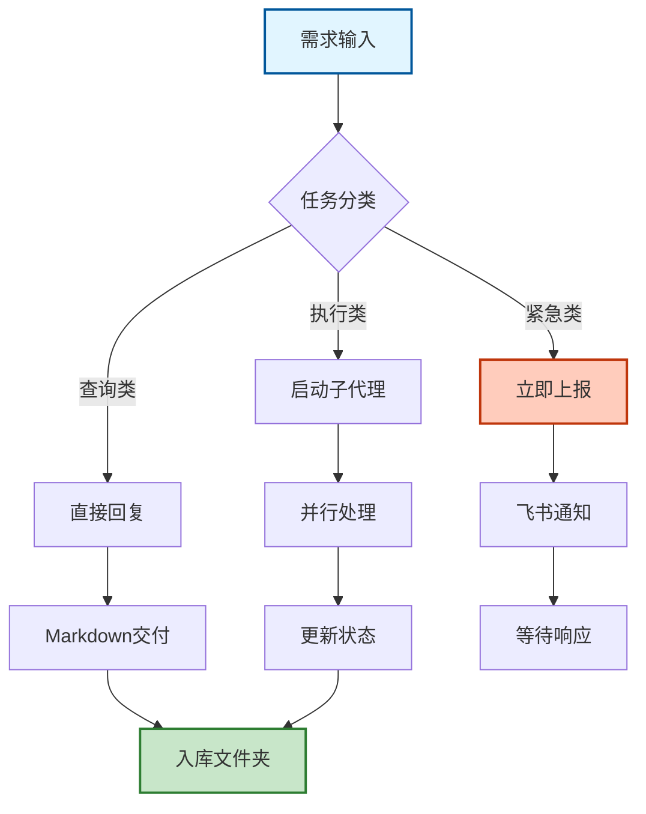
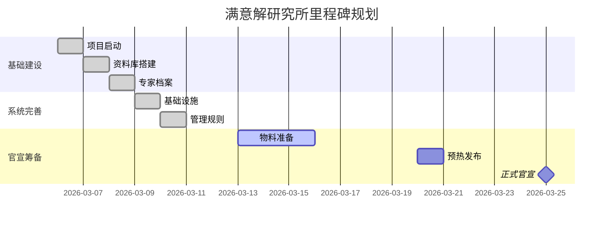
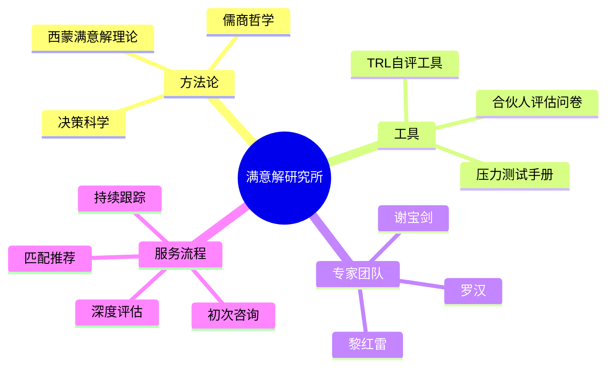
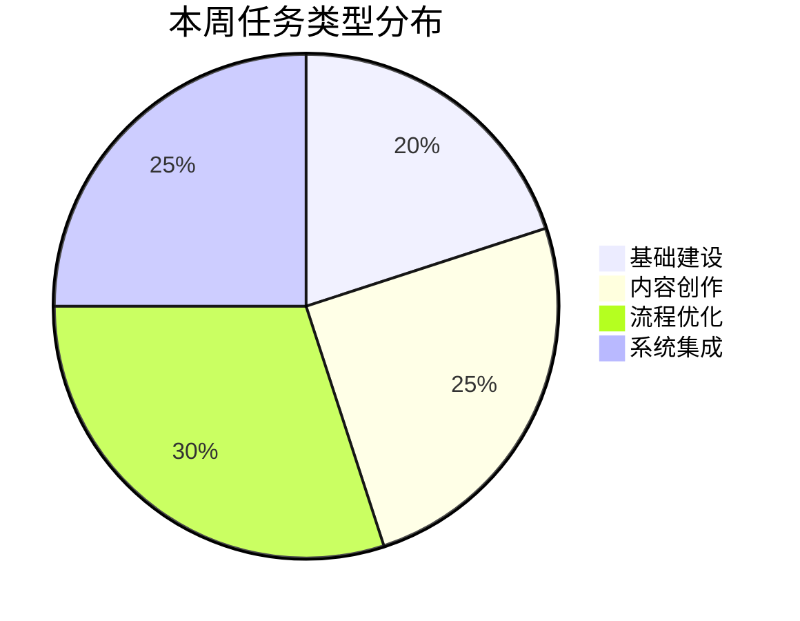
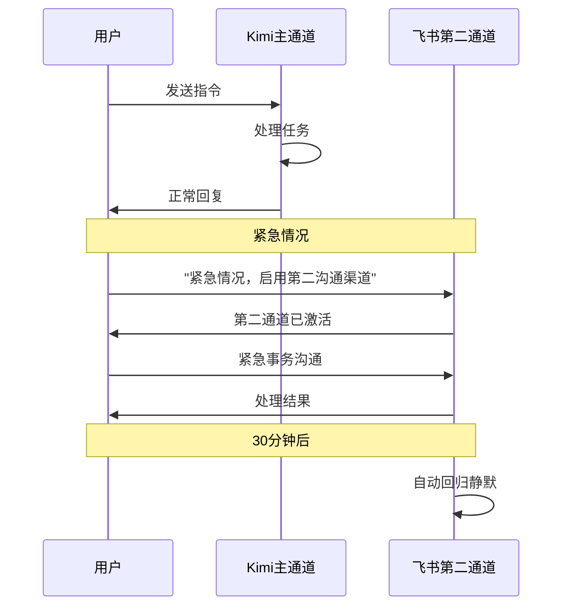
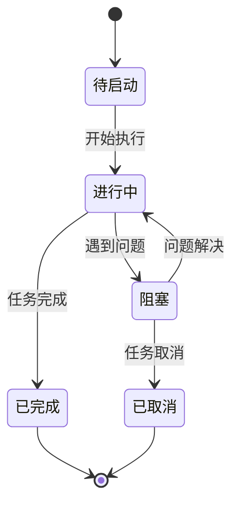
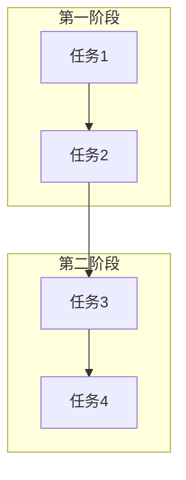

# 🎨 Mermaid 图表模板库

> **用途：** 常用图表快速复制使用  
> **使用方法：** 复制代码 → 粘贴到 https://mermaid.live → 下载图形

---

## 1️⃣ 流程图（Flowchart）

### 项目工作流程


### 决策树
```mermaid
graph TD
    A{是否阻塞?} -->|是| B[分析原因]
    A -->|否| C[正常推进]
    B -->{用户输入?}
    C --> D[更新进度]
    {用户输入?} -->|需要| E[立即请求]
    {用户输入?} -->|不需要| F[自主解决]
    E --> G[24h内清零]
    F --> G
```

---

## 2️⃣ 甘特图（Gantt）

### 项目里程碑排期


---

## 3️⃣ 脑图（Mindmap）

### 满意解研究所知识体系


---

## 4️⃣ 饼图（Pie）

### 任务类型分布


---

## 5️⃣ 时序图（Sequence）

### 双通道通信流程


---

## 6️⃣ 状态图（State Diagram）

### 任务状态流转


---

## 📋 快速使用指南

### 步骤1：选择图表类型
- 流程关系 → Flowchart
- 时间规划 → Gantt
- 知识结构 → Mindmap
- 比例分布 → Pie
- 交互流程 → Sequence
- 状态变化 → State

### 步骤2：复制代码
点击代码块右上角复制按钮

### 步骤3：渲染图形
1. 打开 https://mermaid.live
2. 粘贴代码
3. 自动渲染

### 步骤4：导出使用
- PNG → 插入文档/PPT
- SVG → 矢量编辑
- PDF → 打印分享

---

## 💡 进阶技巧

### 自定义样式


### 子图分组


---

*复制即用，快速出图。*
