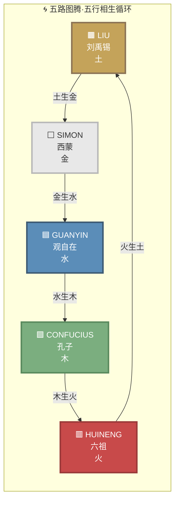
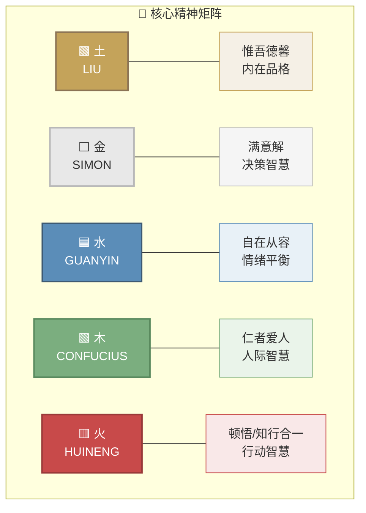
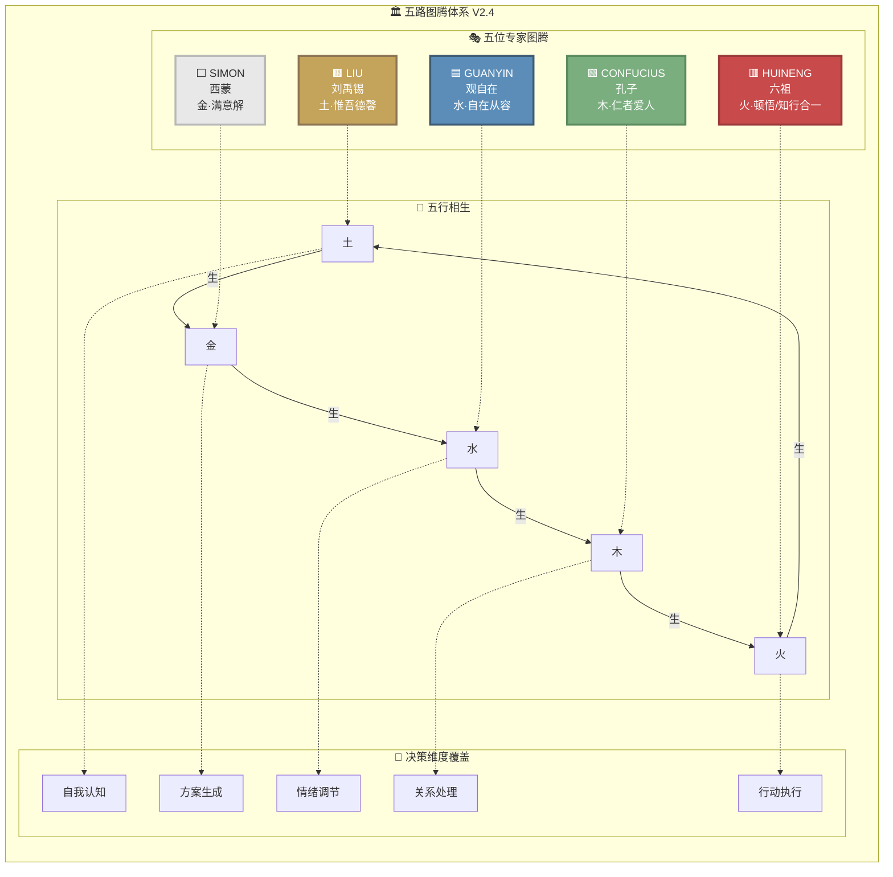

# 五路图腾信息图 V1.0

> 满意解研究所 · 五路图腾体系V2.4 视觉呈现方案
> 生成时间：2026-03-14 00:25 GMT+8

---

## 一、Mermaid 五行相生循环图

### 1.1 核心循环图



### 1.2 核心精神与图腾对应图



### 1.3 完整体系架构图



---

## 二、视觉设计说明

### 2.1 配色方案

#### 2.1.1 五行标准色

| 图腾 | 五行 | 主色 | 色值 | 辅助色 | 应用说明 |
|------|------|------|------|--------|----------|
| LIU | 土 | 土黄 | `#C4A35A` | `#8B7355` | 沉稳、根基、品格 |
| SIMON | 金 | 银白 | `#E8E8E8` | `#B8B8B8` | 理性、精确、决策 |
| GUANYIN | 水 | 靛蓝 | `#5B8DB8` | `#3D5A73` | 流动、智慧、从容 |
| CONFUCIUS | 木 | 青绿 | `#7BAE7F` | `#5A8A5E` | 生长、仁爱、关系 |
| HUINENG | 火 | 朱红 | `#C84A4A` | `#9A3A3A` | 热情、顿悟、行动 |

#### 2.1.2 背景与中性色

| 用途 | 色值 | 说明 |
|------|------|------|
| 深色背景 | `#1A1A2E` | 主背景，神秘专业感 |
| 浅色背景 | `#F8F9FA` | 文档/PPT背景 |
| 卡片背景 | `#FFFFFF` | 内容卡片，干净明亮 |
| 边框/分隔线 | `#E0E0E0` | 轻微分隔，不抢焦点 |
| 文字主色 | `#2C3E50` | 正文文字 |
| 文字辅助 | `#6C757D` | 说明文字、标签 |

#### 2.1.3 渐变方案（高级应用）

```css
/* 五行渐变环 */
.gradient-cycle {
  background: conic-gradient(
    #C4A35A 0deg 72deg,    /* 土 - 72° */
    #E8E8E8 72deg 144deg,  /* 金 - 72° */
    #5B8DB8 144deg 216deg, /* 水 - 72° */
    #7BAE7F 216deg 288deg, /* 木 - 72° */
    #C84A4A 288deg 360deg  /* 火 - 72° */
  );
}

/* 单个图腾卡片渐变 */
.liu-gradient { background: linear-gradient(135deg, #C4A35A 0%, #8B7355 100%); }
.simon-gradient { background: linear-gradient(135deg, #E8E8E8 0%, #B8B8B8 100%); }
.guanyin-gradient { background: linear-gradient(135deg, #5B8DB8 0%, #3D5A73 100%); }
.confucius-gradient { background: linear-gradient(135deg, #7BAE7F 0%, #5A8A5E 100%); }
.huineng-gradient { background: linear-gradient(135deg, #C84A4A 0%, #9A3A3A 100%); }
```

### 2.2 字体建议

#### 2.2.1 中文排版

| 用途 | 推荐字体 | 备选字体 | 说明 |
|------|----------|----------|------|
| 标题/图腾名 | 思源黑体 Bold | 微软雅黑 Bold | 现代、清晰、有力量感 |
| 副标题 | 思源黑体 Medium | 微软雅黑 | 层次清晰 |
| 正文 | 思源黑体 Regular | 微软雅黑 | 易读性高 |
| 英文/拼音 | Montserrat | Inter | 几何感，与中文协调 |
| 核心精神 | 方正清刻本悦宋 | 思源宋体 | 文化感、东方气质 |

#### 2.2.2 字号规范

| 元素 | 桌面端 | 移动端 | 字重 |
|------|--------|--------|------|
| 图腾名称（LIU等） | 48px | 28px | Bold |
| 五行标识（土/金/水/木/火） | 24px | 16px | Medium |
| 核心精神 | 20px | 14px | Regular |
| 说明文字 | 16px | 12px | Regular |
| 标签/辅助 | 14px | 10px | Light |

### 2.3 布局建议

#### 2.3.1 核心布局：五行循环圆环

```
                    ┌─────────────┐
                    │   土生金    │
                    │      ↓      │
            ┌───────┴─────┐ ┌─────┴───────┐
            │   🟫 LIU    │ │  ⬜ SIMON   │
            │    土·惟吾  │ │   金·满意解 │
            │    德馨     │ │             │
            └───────┬─────┘ └─────┬───────┘
                    │             │
          火生土    │             │    金生水
            ↑       │             │       ↓
┌───────────┴───┐   │             │   ┌───┴───────────┐
│  🟥 HUINENG   │◄──┘             └──►│  🟦 GUANYIN   │
│  火·顿悟知行  │                     │  水·自在从容  │
└───────────┬───┘                     └───┬───────────┘
            ↑                             │
          木生火                          │ 水生木
            │                             ↓
            │   ┌─────────────┐   ┌───────┴─────┐
            └──►│ 🟩 CONFUCIUS│   │             │
                │ 木·仁者爱人 │   │   中心留白  │
                └─────────────┘   │  /品牌Logo  │
                                  └─────────────┘
```

#### 2.3.2 卡片式布局（列表展示）

```
┌────────────────────────────────────────────────────────────┐
│                    五路图腾体系 V2.4                        │
├────────────────────────────────────────────────────────────┤
│ ┌─────────┐  ┌─────────┐  ┌─────────┐  ┌─────────┐        │
│ │  🟫     │  │  ⬜     │  │  🟦     │  │  🟩     │        │
│ │  LIU    │  │  SIMON  │  │ GUANYIN │  │CONFUCIUS│ ...    │
│ │ 惟吾德馨 │  │ 满意解  │  │自在从容 │  │仁者爱人 │        │
│ │   土    │  │   金    │  │   水    │  │   木    │        │
│ └─────────┘  └─────────┘  └─────────┘  └─────────┘        │
│                          [土生金] [金生水] [水生木]        │
└────────────────────────────────────────────────────────────┘
```

#### 2.3.3 时间轴布局（流程展示）

```
决策流程：

[自我认知] ──► [方案生成] ──► [情绪平衡] ──► [关系处理] ──► [行动执行]
      │              │              │              │              │
   🟫 LIU        ⬜ SIMON      🟦 GUANYIN    🟩 CONFUCIUS   🟥 HUINENG
   惟吾德馨       满意解         自在从容       仁者爱人       顿悟知行
      │              │              │              │              │
    土生金 ──────► 金生水 ──────► 水生木 ──────► 木生火 ──────► 火生土 ──► 循环
```

---

## 三、使用场景建议

### 3.1 官网展示

#### 场景：首页品牌展示区
- **布局**：全屏英雄区（Hero Section）
- **尺寸**：1920×800px
- **内容**：动态循环图 + 中心品牌Logo
- **交互**：鼠标悬停显示各图腾详情
- **配色**：深色背景 `#1A1A2E` + 亮色图腾

#### 场景：关于我们-专家团队
- **布局**：卡片网格（5列/响应式）
- **尺寸**：单卡 280×400px
- **内容**：图腾符号 + 名称 + 核心精神 + 简介
- **配色**：浅色背景 `#F8F9FA` + 彩色卡片

### 3.2 PPT演示

#### 场景：项目介绍/路演
- **推荐页面**：
  1. **封面页**：循环图中心 + 项目Logo
  2. **团队介绍页**：5张并列卡片
  3. **方法论页**：五行相生流程图
  4. **结束页**：简化版循环图 + 联系方式

- **配色建议**：
  - 深色主题：适合科技/专业感
  - 浅色主题：适合清新/亲和感

#### PPT尺寸适配

| 比例 | 尺寸 | 适用场景 |
|------|------|----------|
| 16:9 | 1920×1080 | 标准演示、路演 |
| 4:3 | 1024×768 | 传统投影、内部会议 |
| 竖版 | 1080×1920 | 移动端展示 |

### 3.3 海报设计

#### 场景：官宣海报（社媒发布）
- **尺寸**：1080×1080px（Instagram/微信朋友圈）
- **布局**：循环图居中 + 底部品牌信息
- **元素**：
  - 主视觉：五行循环
  - 标题：「五路图腾体系 V2.4」
  - 副标题：满意解研究所 · 官宣
  - 底部：Logo + 二维码

#### 场景：易拉宝/展架
- **尺寸**：800×2000mm
- **布局**：竖版堆叠展示
  - 顶部：品牌Logo
  - 中部：循环图 + 简要说明
  - 底部：5位专家详细介绍

### 3.4 印刷物料

#### 场景：宣传册/白皮书封面
- **尺寸**：A4（210×297mm）
- **风格**：极简专业
- **元素**：
  - 封面：简化循环图 + 书名
  - 封底：品牌信息 + 联系方式
  - 内页：每位专家详细解读

#### 场景：名片/工牌
- **尺寸**：90×54mm（名片）
- **设计**：每位团队成员对应专属图腾色
- **元素**：
  - 正面：Logo + 姓名 + 职位 + 对应图腾色块
  - 背面：联系方式 + 五路图腾迷你版

### 3.5 数字媒体

#### 场景：视频开场/转场
- **时长**：3-5秒
- **动画**：五行循环旋转进入
- **音效**：东方风格轻音乐 + 简单音效

#### 场景：动态GIF/表情包
- **尺寸**：480×480px
- **内容**：单个图腾动画/循环相生动画
- **用途**：微信/钉钉表情包、社媒互动

---

## 四、设计决策记录

### 4.1 已确认决策

| 决策项 | 选择 | 原因 |
|--------|------|------|
| 五行配色 | 传统五色 | 符合文化底蕴，易于识别 |
| 循环方向 | 顺时针 | 符合五行相生自然规律 |
| 中心留白 | 品牌Logo位 | 突出品牌识别 |
| 字体风格 | 现代黑体 + 衬线点缀 | 专业+文化感平衡 |

### 4.2 待讨论决策

| 决策项 | 选项 | 建议 |
|--------|------|------|
| 头像风格 | 插画/照片/符号 | 建议统一插画风格，增强品牌一致性 |
| 动态效果 | 静态/微动效/全动画 | 建议官网用微动效，印刷用静态 |
| 英文占比 | 中英双语/中文为主 | 建议中文为主，英文用于国际化场景 |

---

## 五、附录

### 5.1 版本历史

| 版本 | 日期 | 更新内容 |
|------|------|----------|
| V1.0 | 2026-03-14 | 初版发布，含Mermaid图、设计规范、场景建议 |

### 5.2 相关文档

- 五路图腾体系V2.4完整定义
- 品牌视觉识别系统（VIS）
- 设计交付文档（SVG源文件）

### 5.3 联系信息

- **制作者**：满意解研究所 · AI设计组
- **更新时间**：2026-03-14 00:25 GMT+8
- **状态**：✅ 已完成

---

> 📝 **备注**：本文档为五路图腾体系V2.4的视觉呈现方案，包含可直接使用的Mermaid代码和设计规范。如需SVG矢量源文件，请参考设计交付文档。
