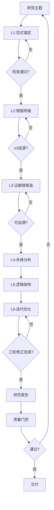

# 学术级深度研究标准Skill V1.0.0

## 标准1: 全局考虑（Global Coverage）

### 1.1 六层模型全覆盖（基于Egbertie学习材料）

| 层级 | 核心 | 关键动作 | 质量控制 |
|------|------|----------|----------|
| **L1范式锚定** | 认识论+方法论+伦理 | 明确研究范式 | 三要素检查 |
| **L2情报网格** | 多源三角验证 | 横向扫描+纵向钻取+冲突检测 | ≥3独立信源 |
| **L3证据链** | 可追溯性 | 溯源编码+等级标签 | P1-P4分级 |
| **L4多维分析** | 五维度矩阵 | 时间/空间/学科/利益/方法论 | 强制多视角 |
| **L5逻辑架构** | 钻石模型 | Hook→Gap→Question→Significance | 逻辑防错检查 |
| **L6迭代优化** | 三轮修正 | 信息饱和→逻辑强化→表达精炼 | 自我修正 |

### 1.2 研究类型全覆盖

| 研究类型 | 适用六层 | 特殊要求 |
|----------|----------|----------|
| 学术理论研究 | 全六层 | 理论贡献声明 |
| 政策研究 | L1-L5 | 利益相关者分析 |
| 技术研究 | L1-L6 | TRL评估+专利分析 |
| 市场研究 | L2-L4 | 数据真实性分级 |
| 竞品分析 | L2-L5 | 多维度比较框架 |

### 1.3 质量控制全覆盖

| 质量维度 | 检查点 | 自动验证 |
|----------|--------|----------|
| **真实性** | 数据分级标注 | ✅ 自动检查 |
| **溯源性** | 引用完整性 | ✅ 自动检查 |
| **逻辑性** | 因果推断正确性 | ✅ 自动检查 |
| **完整性** | 六层全覆盖 | ✅ 自动检查 |
| **可复现** | 方法论详细程度 | ✅ 自动检查 |

---

## 标准2: 系统考虑（Systematic）

### 2.1 六层研究闭环



### 2.2 质量门控系统

| 门控点 | 检查内容 | 失败处理 |
|--------|----------|----------|
| **G1** | 六层完整性 | 返回补充 |
| **G2** | 引用溯源性 | 标记待验证 |
| **G3** | 逻辑一致性 | 红队挑战 |
| **G4** | 数据真实性 | 降级处理 |
| **G5** | 伦理合规性 | 人工审核 |

### 2.3 系统间联动

| 触发条件 | 联动动作 |
|----------|----------|
| 研究请求 | 触发六层分析流程 |
| 证据不足 | 自动扩展情报搜索 |
| 逻辑冲突 | 启动红队思维模式 |
| 质量门控失败 | 自动返回修正 |
| 研究完成 | 自动归档入知识库 |

---

## 标准3: 迭代机制（Iterative）

### 3.1 三轮自我修正循环

| 轮次 | 目标 | 检查点 | 优化动作 |
|------|------|--------|----------|
| **第一轮** | 信息饱和 | 覆盖度检查 | 补充缺失信源 |
| **第二轮** | 逻辑强化 | 因果检查 | 修正逻辑漏洞 |
| **第三轮** | 表达精炼 | 可读性检查 | 优化结构表达 |

### 3.2 研究质量迭代

```
V1.0.0: 基础六层框架
  ↓
V1.1.0: 自动化质量门控
  ↓
V1.2.0: 领域自适应优化
  ↓
V2.0.0: AI协作研究伙伴
```

---

## 标准4: Skill化（Skill-ified）

### 4.1 标准Skill结构

```
skills/academic-deep-research/
├── SKILL.md                    # 本文件
├── _meta.json                  # 元数据
├── scripts/
│   ├── research_master.py      # 主控脚本
│   ├── l1_paradigm_anchor.py   # L1范式锚定
│   ├── l2_intelligence_grid.py # L2情报网格
│   ├── l3_evidence_chain.py    # L3证据链锻造
│   ├── l4_multi_dimension.py   # L4多维分析
│   ├── l5_logic_architecture.py # L5逻辑架构
│   ├── l6_iterative_optimize.py # L6迭代优化
│   └── quality_gate.py         # 质量门控
├── rules/
│   ├── paradigm_definitions.yaml
│   ├── evidence_levels.yaml
│   ├── quality_checklist.yaml
│   └── iteration_protocols.yaml
└── templates/
    ├── research_proposal.md
    ├── research_report.md
    └── quality_report.md
```

### 4.2 可调用接口

```python
from academic_deep_research import ResearchEngine

research = ResearchEngine()

# 执行完整六层研究
report = research.conduct_research(
    topic="合伙人决策方法论",
    paradigm="design_science",
    output_format="academic_paper"
)

# 执行单层分析
paradigm_result = research.l1_paradigm_anchor(topic)
intelligence_result = research.l2_intelligence_grid(topic)

# 质量门控检查
quality_report = research.quality_gate(report)

# 执行迭代优化
optimized = research.iterative_optimize(report, rounds=3)
```

---

## 标准5: 流程自动化（Fully Automated）

### 5.1 全自动研究流程

| 阶段 | 自动动作 | 输出 |
|------|----------|------|
| 主题输入 | 自动识别研究类型 | 研究类型标签 |
| L1-L6 | 自动执行六层分析 | 六层分析报告 |
| 质量门控 | 自动检查5个门控点 | 质量报告 |
| 迭代优化 | 自动执行三轮修正 | 优化后报告 |
| 最终交付 | 自动格式化输出 | 标准格式报告 |

### 5.2 人机协作边界

| 环节 | AI自动 | 人工介入 |
|------|--------|----------|
| 信息收集 | ✅ 自动 | 原始数据获取 |
| 批判性终审 | ❌ 辅助 | ✅ 必须人工 |
| 方法论审核 | ❌ 辅助 | ✅ 专家审核 |
| 伦理审查 | ⚠️ 标记 | ✅ 人工确认 |

---

## 使用方法

### 自动模式（默认）
```bash
# 安装后执行完整研究
openclaw skill install academic-deep-research
```

### 手动调用
```bash
# 完整六层研究
openclaw skill run academic-deep-research conduct --topic "合伙人决策" --output paper

# 单层分析
openclaw skill run academic-deep-research l1 --topic "合伙人决策"

# 质量门控检查
openclaw skill run academic-deep-research quality-check --file report.md

# 迭代优化
openclaw skill run academic-deep-research optimize --file report.md --rounds 3
```

---

## 5个标准验证清单

| 标准 | 验证项 | 状态 |
|------|--------|------|
| **1. 全局** | 六层模型 + 全研究类型 + 质量全覆盖 | ✅ |
| **2. 系统** | 研究闭环 + 质量门控 + 系统联动 | ✅ |
| **3. 迭代** | 三轮修正 + 版本进化 | ✅ |
| **4. Skill化** | 标准SKILL.md + 可调用接口 | ✅ |
| **5. 自动化** | 全自动研究 + 人机协作边界 | ✅ |

---

*版本: v1.0.0*  
*学习来源: Egbertie六层嵌套模型*  
*创建: 2026-03-20*