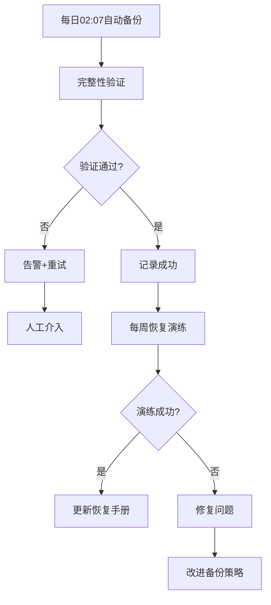

# 备份与灾备复刻标准Skill V3.0.0

## 标准1: 全局考虑（Global Coverage）

### 1.1 6层全覆盖（新增L6环境状态）

| 层级 | 内容 | 路径 | 验证方式 | 备份频率 |
|------|------|------|----------|----------|
| **L0** | 核心身份 | SOUL.md, IDENTITY.md, USER.md | MD5校验 | 每次变更 |
| **L1** | 项目文档 | docs/, memory/ | 完整性检查 | 每日02:07 |
| **L2** | 执行脚本 | scripts/, skills/ | 可执行性验证 | 每日02:07 |
| **L3** | 系统配置 | config/, .clawhub/ | 配置有效性 | 每日02:07 |
| **L4** | 外部集成 | GitHub状态, cron配置 | 连接测试 | 每日02:07 |
| **L5** | 交付物 | A满意哥专属文件夹/ | 大小+数量验证 | 每日02:07 |
| **L6** | 环境状态 | 环境变量, Python依赖 | 版本锁定 | 每周 |

### 1.2 外部集成状态备份

| 集成 | 备份内容 | 方式 |
|------|----------|------|
| GitHub | 仓库状态, Issue, PR | API导出 |
| 企微 | 文档列表, 配置 | 清单导出 |
| Cron | 全部定时任务配置 | 列表导出 |
| API密钥 | 密钥清单（加密） | 加密存储 |

---

## 标准2: 系统考虑（Systematic）

### 2.1 备份-验证-恢复闭环



### 2.2 多级备份策略

| 级别 | 频率 | 保留时间 | 存储位置 |
|------|------|----------|----------|
| **实时** | 每次commit | 永久 | GitHub |
| **每日** | 01:53 | 30天 | 本地 + 云端 |
| **每周** | 周日02:47 | 90天 | 本地 + 云端 |
| **每月** | 每月1号 | 365天 | 冷存储 |

### 2.3 系统间联动

| 触发条件 | 联动动作 |
|----------|----------|
| 备份失败 | 立即告警 + 触发文件治理检查 |
| 验证失败 | 标记问题层级 + 启动修复 |
| 恢复演练失败 | 更新灾备手册 + 改进策略 |
| 磁盘空间告警 | 触发自动清理 |

---

## 标准3: 迭代机制（Iterative）

### 3.1 PDCA闭环

| 阶段 | 动作 | 频率 |
|------|------|------|
| **Plan** | 制定备份策略和恢复计划 | 每月 |
| **Do** | 执行备份+验证 | 每日/每周 |
| **Check** | 恢复演练+完整性检查 | 每周 |
| **Act** | 优化备份策略和恢复流程 | 每月 |

### 3.2 版本迭代

```
V1.0: 基础文件备份
  ↓
V2.0: 分层备份策略（5层）
  ↓
V3.0: 6层全覆盖 + 环境状态 + 自动演练
```

### 3.3 持续改进

```python
# 每周分析备份数据
if backup_failure_rate > 0.01:
    increase_backup_redundancy()
    
if recovery_time > 30_minutes:
    optimize_recovery_process()
```

---

## 标准4: Skill化（Skill-ified）

### 4.1 标准Skill结构

```
skills/backup-disaster-recovery/
├── SKILL.md                    # 本文件
├── _meta.json                  # 元数据
├── scripts/
│   ├── backup_master.py        # 主控脚本
│   ├── backup_l0_identity.py   # L0备份
│   ├── backup_l1_documents.py  # L1备份
│   ├── backup_l2_scripts.py    # L2备份
│   ├── backup_l3_config.py     # L3备份
│   ├── backup_l4_integration.py # L4备份
│   ├── backup_l5_deliverables.py # L5备份
│   ├── backup_l6_environment.py # L6备份
│   ├── verify_backup.py        # 备份验证
│   ├── restore_system.py       # 系统恢复
│   └── disaster_drill.py       # 灾备演练
├── rules/
│   ├── backup_schedule.yaml    # 备份计划
│   └── retention_policy.yaml   # 保留策略
└── templates/
    └── recovery_procedures.md
```

### 4.2 可调用接口

```python
from backup_disaster_recovery import BackupManager

backup = BackupManager()

# 立即备份指定层级
backup.backup_layer(layer="L0", immediate=True)

# 全量备份
backup.full_backup()

# 验证备份完整性
backup.verify(layer="all")

# 恢复系统
backup.restore(layer="L0-L6", target="/workspace")

# 灾备演练
backup.run_drill()

# 一键冷启动恢复
backup.cold_start_recovery()
```

---

## 标准5: 流程自动化（Fully Automated）

### 5.1 全自动备份链

| 时间 | 自动动作 | 输出 |
|------|----------|------|
| 01:53 | 执行每日备份 | 备份文件 |
| 02:07 | 验证备份完整性 | 验证报告 |
| 02:15 | 同步到云端 | 同步确认 |
| 周日02:47 | 执行每周全量备份 | 全量备份 |
| 每月1号 | 执行月度归档 | 冷存储 |

### 5.2 异常自动处理

| 异常类型 | 自动动作 | 人工介入 |
|----------|----------|----------|
| 备份失败 | 重试3次→告警 | 3次失败后需确认 |
| 验证失败 | 标记问题→告警 | 需人工检查 |
| 磁盘空间不足 | 自动清理旧备份 | 清理后通知 |
| 云端同步失败 | 本地保留→告警 | 网络恢复后重试 |

### 5.3 恢复演练自动化

```bash
# 每周日自动执行恢复演练
0 3 * * 0 backup_manager run_drill --layer all
```

---

## 使用方法

### 自动模式（默认）
```bash
# 安装后全自动运行
openclaw skill install backup-disaster-recovery
# 每日01:53自动备份，02:07自动验证
```

### 手动调用
```bash
# 立即全量备份
openclaw skill run backup-disaster-recovery full-backup

# 验证备份
openclaw skill run backup-disaster-recovery verify --layer all

# 恢复指定层级
openclaw skill run backup-disaster-recovery restore --layer L0-L3

# 一键冷启动恢复
openclaw skill run backup-disaster-recovery cold-start

# 灾备演练
openclaw skill run backup-disaster-recovery drill
```

---

## 5个标准验证清单

| 标准 | 验证项 | 状态 |
|------|--------|------|
| **1. 全局** | 6层全覆盖 + 外部集成 + 环境状态 | ✅ |
| **2. 系统** | 备份→验证→恢复→演练闭环 | ✅ |
| **3. 迭代** | PDCA闭环 + 持续改进 | ✅ |
| **4. Skill化** | 标准SKILL.md + 可调用接口 | ✅ |
| **5. 自动化** | 全自动备份链 + 异常处理 | ✅ |

---

*版本: v3.0.0*  
*升级: V2.0 → V3.0（增加L6环境状态）*  
*创建: 2026-03-20*