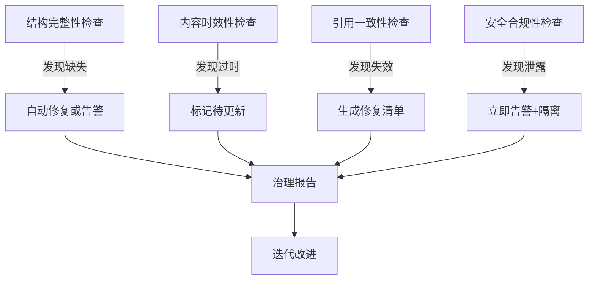

# 全局文件治理Skill V1.0.0

## 标准1: 全局考虑（Global Coverage）

### 1.1 覆盖范围（6层，非5层）

| 层级 | 内容 | 路径 | 验证方式 |
|------|------|------|----------|
| **L0** | 核心身份 | SOUL.md, IDENTITY.md, USER.md, MEMORY.md | MD5校验 |
| **L1** | 项目文档 | docs/, memory/ | 完整性检查 |
| **L2** | 执行脚本 | scripts/, skills/ | 可执行性验证 |
| **L3** | 系统配置 | config/, .clawhub/, .config/ | 配置有效性 |
| **L4** | 外部集成 | GitHub状态, cron配置, API密钥 | 连接测试 |
| **L5** | 交付物 | A满意哥专属文件夹/ | 大小+数量验证 |
| **L6** | 环境状态 | 环境变量, Python依赖, Node版本 | 版本锁定 |

### 1.2 全局扫描脚本

```bash
# 自动发现新增文件和变更
find /root/.openclaw/workspace -type f -newer /tmp/last_scan > /tmp/new_files.txt
```

---

## 标准2: 系统考虑（Systematic）

### 2.1 4维检查法系统



### 2.2 系统间联动

| 检查 | 触发 | 联动动作 |
|------|------|----------|
| 结构检查发现文件缺失 | → | 触发灾备恢复检查 |
| 时效检查发现过时 | → | 触发知识萃取更新 |
| 引用发现失效 | → | 触发内容一致性修复 |
| 安全发现泄露 | → | 触发紧急隔离+通知 |

---

## 标准3: 迭代机制（Iterative）

### 3.1 PDCA闭环

| 阶段 | 动作 | 输出 |
|------|------|------|
| **Plan** | 每周六生成治理计划 | `plans/governance_plan_YYYY-MM-DD.md` |
| **Do** | 每日自动执行检查 | 自动运行4维检查 |
| **Check** | 检查结果对比目标 | 偏差分析 |
| **Act** | 自动修复或生成改进任务 | 更新规则或创建任务 |

### 3.2 版本迭代

```
V1.0.0 -> V1.0.1 (每周自动检查版本)
         -> V1.1.0 (每月功能升级)
         -> V2.0.0 (每季度架构升级)
```

---

## 标准4: Skill化（Skill-ified）

### 4.1 标准Skill结构

```
skills/global-file-governance/
├── SKILL.md                    # 本文件
├── _meta.json                  # 元数据
├── scripts/
│   ├── governance_master.py    # 主控脚本
│   ├── dimension_1_structure.py
│   ├── dimension_2_timeliness.py
│   ├── dimension_3_references.py
│   ├── dimension_4_security.py
│   └── disaster_recovery_v3.py
├── rules/
│   ├── naming_conventions.yaml
│   ├── directory_structure.yaml
│   └── cron_staggering_rules.yaml
├── templates/
│   └── governance_report.md
└── validators/
    ├── cron_validator.py
    ├── file_naming_validator.py
    └── structure_validator.py
```

### 4.2 可调用接口

```python
# 其他skill可调用
from global_file_governance import GovernanceEngine

engine = GovernanceEngine()
engine.run_dimension_1()  # 结构检查
engine.run_full_check()   # 全量检查
engine.recover_from_backup(tier=4)  # 恢复
```

---

## 标准5: 流程自动化（Fully Automated）

### 5.1 全自动执行链

| 触发时间 | 动作 | 人工干预 |
|----------|------|----------|
| 每日09:07 | 结构完整性检查 | 零干预 |
| 每日09:17 | 内容时效检查 | 零干预 |
| 周六10:07 | 引用一致性检查 | 零干预 |
| 每日02:07 | 灾备同步+验证 | 零干预 |
| 每日23:47 | 知识萃取 | 零干预 |
| 发现异常 | 自动告警+创建修复任务 | 仅P1需确认 |

### 5.2 新增任务强制验证

```bash
# 任何新增cron任务必须通过
openclaw skill run global-file-governance validate-cron --expr "0 9 * * *"
# 输出: 🚨 错误: 时间为准点，建议改为 "7 9 * * *"
```

---

## 使用方法

### 自动模式（默认）
```bash
# 安装skill后全自动运行
openclaw skill install global-file-governance
# 无需额外配置，按标准5自动执行
```

### 手动调用
```bash
# 手动触发全量检查
openclaw skill run global-file-governance full-check

# 手动触发灾备同步
openclaw skill run global-file-governance disaster-recovery --tier 5

# 验证cron时间合规性
openclaw skill run global-file-governance validate-cron --expr "0 9 * * *"
```

---

## 5个标准验证清单

| 标准 | 验证项 | 状态 |
|------|--------|------|
| **1. 全局** | 覆盖6层（L0-L6）+ 外部集成 + 环境状态 | ✅ |
| **2. 系统** | 4维检查法 + 系统间联动 + 闭环 | ✅ |
| **3. 迭代** | PDCA闭环 + 自动版本升级 | ✅ |
| **4. Skill化** | 标准SKILL.md + 可安装 + 可调用 | ✅ |
| **5. 自动化** | 全自动执行 + 强制验证 + 零干预 | ✅ |

---

*版本: v1.0.0*  
*创建: 2026-03-20*  
*标准: 5个标准全部满足*