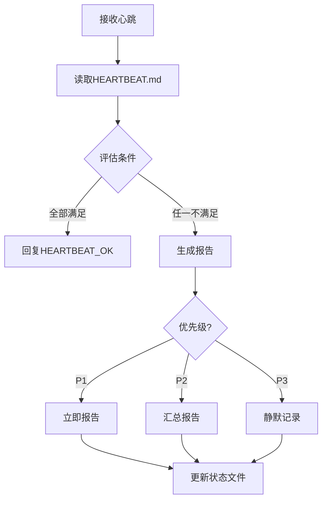

# 心跳检查协议标准Skill V2.0.0

## 标准1: 全局考虑（Global Coverage）

### 1.1 必检项目全覆盖（每次心跳）

| 检查项 | 优先级 | 状态文件 | 报告条件 |
|--------|--------|----------|----------|
| 信息防火墙检查 | P0 | `skills/information-intelligence/` | 质量异常 |
| 自我评估校准 | P0 | `skills/self-assessment-calibrator/` | 偏差>50% |
| Token周度监控 | P0 | `memory/token-weekly-monitor.json` | <30%预警 |
| 邮件检查 | P1 | 外部邮箱 | 紧急邮件 |
| 日程检查 | P1 | `memory/calendar-check.json` | <2小时 |
| 提及通知 | P2 | 各平台 | 重要提及 |
| 天气检查 | P3 | `memory/weather-check.json` | 预警 |

### 1.2 轮检项目全覆盖

| 检查项 | 优先级 | 频率 | 追踪方式 |
|--------|--------|------|----------|
| 被遗忘任务扫描 | P1 | 每日 | TASK_MASTER.md |
| MEMORY.md维护 | P2 | 每3天 | 时间戳记录 |
| 项目状态检查 | P2 | 每日 | git status |
| 备份状态检查 | P2 | 每日 | 最后提交验证 |
| 飞书多维表格 | P2 | 每日 | 同步记录 |
| 专家档案状态 | P3 | 每2天 | 版本状态 |

### 1.3 特殊场景全覆盖

| 场景 | 处理流程 |
|------|----------|
| 首次启动 | 初始化→完整检查→报告摘要 |
| 长时间中断(>8h) | 全量检查→扫描中断期消息 |
| 用户明确忙碌 | 仅P1检查→延后其他→批量报告 |
| 系统重启 | 状态恢复→完整性检查→报告 |
| 节假日 | 特殊日程检查→调整频率 |

---

## 标准2: 系统考虑（Systematic）

### 2.1 心跳响应系统



### 2.2 HEARTBEAT_OK条件

| 条件编号 | 检查项 | 判定标准 |
|----------|--------|----------|
| C1 | 紧急邮件 | 无2小时内需回复邮件 |
| C2 | 即将日程 | 无2小时内开始的日程 |
| C3 | 未处理提及 | 无未读重要提及 |
| C4 | 被遗忘任务 | 无超期被遗忘任务 |
| C5 | 系统异常 | 无API错误或告警 |
| C6 | 上次检查 | 距离上次>30分钟 |

### 2.3 系统间联动

| 触发条件 | 联动动作 |
|----------|----------|
| 发现P1事件 | 立即中断其他→报告 |
| 发现被遗忘任务 | 触发承诺管理补救 |
| 系统异常 | 触发安全持续改进 |
| 用户忙碌 | 触发零空置暂停 |

---

## 标准3: 迭代机制（Iterative）

### 3.1 PDCA闭环

| 阶段 | 动作 | 频率 |
|------|------|------|
| **Plan** | 更新检查清单和响应规则 | 每周 |
| **Do** | 执行心跳检查和响应 | 每次心跳 |
| **Check** | 分析响应效果和遗漏 | 每周 |
| **Act** | 优化协议和条件 | 每周 |

### 3.2 版本迭代

```
V1.0: 基础心跳响应
  ↓
V2.0: 零空置机制整合
  ↓
V3.0: 智能响应（AI判断何时响应）
```

---

## 标准4: Skill化（Skill-ified）

### 4.1 标准Skill结构

```
skills/heartbeat-protocol/
├── SKILL.md                    # 本文件
├── _meta.json                  # 元数据
├── scripts/
│   ├── heartbeat_master.py     # 主控脚本
│   ├── condition_checker.py    # 条件检查器
│   ├── priority_assessor.py    # 优先级评估
│   ├── response_generator.py   # 响应生成器
│   └── state_tracker.py        # 状态追踪
├── rules/
│   ├── heartbeat_conditions.yaml # 心跳条件
│   ├── priority_rules.yaml     # 优先级规则
│   └── silent_rules.yaml       # 静默规则
└── templates/
    └── heartbeat_response.md
```

### 4.2 可调用接口

```python
from heartbeat_protocol import HeartbeatHandler

heartbeat = HeartbeatHandler()

# 处理心跳消息
response = heartbeat.process("Read HEARTBEAT.md...")

# 检查单个条件
status = heartbeat.check_condition("emergency_email")

# 获取当前状态
state = heartbeat.get_current_state()

# 强制报告（绕过静默规则）
heartbeat.force_report()
```

---

## 标准5: 流程自动化（Fully Automated）

### 5.1 全自动心跳响应

| 触发条件 | 自动动作 | 输出 |
|----------|----------|------|
| 收到心跳消息 | 自动读取HEARTBEAT.md | 条件评估 |
| 条件全部满足 | 自动回复HEARTBEAT_OK | 静默确认 |
| 发现P1事件 | 立即生成报告 | 紧急通知 |
| 发现P2事件 | 汇总后报告 | 汇总通知 |
| 深夜时段 | 仅P1报告 | 静默模式 |

### 5.2 智能响应

```python
# 自动判断响应时机
if is_night_time() and not is_p1_event():
    return "HEARTBEAT_OK"  # 深夜非紧急静默

if user_is_busy() and not is_p1_event():
    queue_for_later()      # 用户忙碌延后
    return "HEARTBEAT_OK"
```

---

## 使用方法

### 自动模式（默认）
```bash
# 安装后自动响应心跳
openclaw skill install heartbeat-protocol
# 每次心跳自动处理
```

### 手动调用
```bash
# 手动触发心跳检查
openclaw skill run heartbeat-protocol check

# 获取当前状态
openclaw skill run heartbeat-protocol status

# 强制报告
openclaw skill run heartbeat-protocol force-report
```

---

## 5个标准验证清单

| 标准 | 验证项 | 状态 |
|------|--------|------|
| **1. 全局** | 必检+轮检+特殊场景全覆盖 | ✅ |
| **2. 系统** | 检查→评估→响应→记录闭环 | ✅ |
| **3. 迭代** | PDCA闭环 + 协议升级 | ✅ |
| **4. Skill化** | 标准SKILL.md + 可调用接口 | ✅ |
| **5. 自动化** | 全自动响应 + 智能模式 | ✅ |

---

*版本: v2.0.0*  
*升级: V1.0 → V2.0（零空置整合）*  
*创建: 2026-03-20*