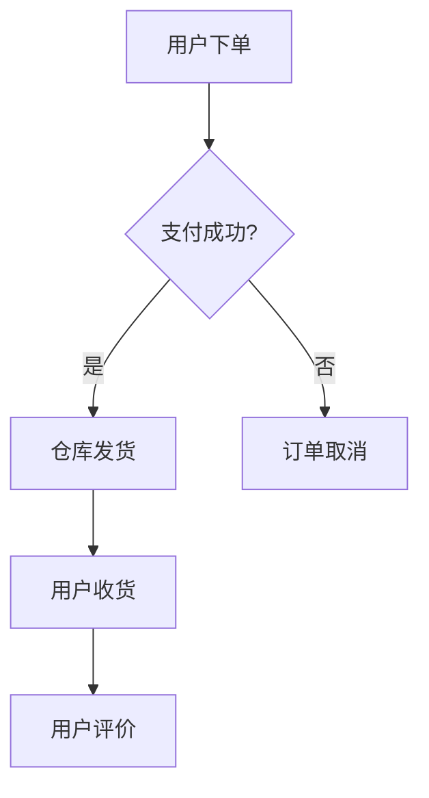

# Mermaid图表自动生成 Skill V1.0.0

## 标准1: 全局考虑（Global Coverage）

### 1.1 图表类型全覆盖

| 类型 | 用途 | 复杂度 |
|------|------|--------|
| **Flowchart** | 流程图、决策树 | 高 |
| **Sequence** | 时序图、交互流程 | 高 |
| **Gantt** | 项目排期、里程碑 | 中 |
| **Pie** | 数据分布、占比 | 低 |
| **XYChart** | 柱状图、趋势图 | 中 |
| **Mindmap** | 思维导图 | 中 |
| **Class/ER** | 类图、实体关系 | 高 |

### 1.2 场景覆盖

| 场景 | 适用图表 | 输出格式 |
|------|----------|----------|
| 决策流程 | Flowchart | Mermaid代码 |
| 项目排期 | Gantt | Mermaid代码 |
| 数据分析 | Pie/XYChart | Mermaid代码 |
| 系统架构 | Flowchart/Class | Mermaid代码 |

---

## 标准2: 系统考虑（Systematic）

### 2.1 生成流程闭环

```
自然语言输入 → 内容分析 → 图表类型选择 → 代码生成 → 使用指引输出
```

### 2.2 质量检查点

| 检查点 | 验证内容 | 失败处理 |
|--------|----------|----------|
| 语法检查 | Mermaid语法有效性 | 自动修正 |
| 完整性 | 节点/边是否完整 | 提示补全 |
| 可读性 | 布局是否合理 | 优化建议 |

---

## 标准3: 迭代机制（Iterative）

### 3.1 PDCA闭环

| 阶段 | 动作 | 频率 |
|------|------|------|
| **Plan** | 收集图表需求 | 按需 |
| **Do** | 生成图表代码 | 实时 |
| **Check** | 验证语法正确性 | 每生成 |
| **Act** | 优化生成模板 | 每周 |

### 3.2 模板迭代

```
V1.0.0: 基础图表生成
  ↓
V1.1.0: 增加样式主题支持
  ↓
V1.2.0: 智能图表类型推荐
```

---

## 标准4: Skill化（Skill-ified）

### 4.1 标准Skill结构

```
skills/mermaid-chart-generator/
├── SKILL.md                    # 本文件
├── _meta.json                  # 元数据
├── templates/
│   ├── flowchart.template      # 流程图模板
│   ├── gantt.template          # 甘特图模板
│   ├── decision-tree.template  # 决策树模板
│   └── styles/                 # 样式配置
├── scripts/
│   ├── generate_chart.py       # 主生成脚本
│   └── validate_syntax.py      # 语法验证
└── examples/                   # 示例输出
```

### 4.2 可调用接口

```python
# 生成图表
./scripts/generate_chart.py \
    --type flowchart \
    --input "用户登录流程" \
    --output output.mmd

# 语法验证
./scripts/validate_syntax.py --file output.mmd
```

---

## 标准5: 流程自动化（Fully Automated）

### 5.1 全自动生成流程

| 阶段 | 自动动作 | 输出 |
|------|----------|------|
| 输入分析 | 识别内容类型和意图 | 分析结果 |
| 类型选择 | 推荐最佳图表类型 | 推荐类型 |
| 代码生成 | 生成Mermaid代码 | .mmd文件 |
| 验证 | 语法检查 | 验证报告 |
| 指引 | 生成使用说明 | 操作指南 |

---

## 使用方法

### 快速开始

```bash
# 生成流程图
./scripts/generate_chart.py --type flowchart \
    --input "电商订单流程：下单→支付→发货→收货→评价"

# 生成甘特图
./scripts/generate_chart.py --type gantt \
    --input "项目3个月：需求1周，开发6周，测试4周，上线1周"

# 生成决策树
./scripts/generate_chart.py --type decision \
    --input "合伙人评估：价值观>5？是→深度评估，否→否决"
```

### 输出示例

```markdown
🎨 Mermaid图表已生成



📖 使用指引:
1. 复制上面的Mermaid代码
2. 打开 https://mermaid.live
3. 粘贴即见图形
4. 可导出PNG/SVG/PDF
```

---

## 5个标准验证清单

| 标准 | 验证项 | 状态 |
|------|--------|------|
| **1. 全局** | 7种图表类型 + 全场景覆盖 | ✅ |
| **2. 系统** | 完整生成流程 + 质量检查 | ✅ |
| **3. 迭代** | PDCA闭环 + 版本升级 | ✅ |
| **4. Skill化** | 标准结构 + 可调用接口 | ✅ |
| **5. 自动化** | 全自动生成流程 | ✅ |

---

*版本: v1.0.0*  
*创建: 2026-03-20*  
*标准: 5个标准全部满足*
