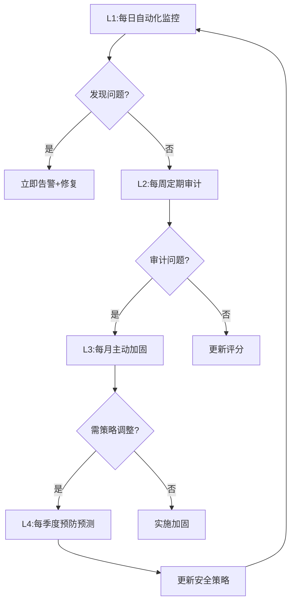

# 安全持续改进标准Skill V1.0.0

## 标准1: 全局考虑（Global Coverage）

### 1.1 L1-L4四级全覆盖

| 层级 | 频率 | 覆盖范围 | 当前评分 | 目标 |
|------|------|----------|----------|------|
| **L1** | 每日 | 自动化监控 | 84/100 | 90/100 |
| **L2** | 每周 | 定期审计 | 84/100 | 90/100 |
| **L3** | 每月 | 主动加固 | - | 92/100 |
| **L4** | 每季度 | 预防预测 | - | 95/100 |

### 1.2 安全维度全覆盖

| 维度 | 检查项 | 监控方式 |
|------|--------|----------|
| **系统安全** | OpenClaw状态, 磁盘空间 | 自动检查 |
| **API安全** | 密钥泄露, 调用异常 | 自动扫描 |
| **数据安全** | 敏感文件, 权限设置 | 自动审计 |
| **代码安全** | 依赖漏洞, 配置泄露 | 自动检测 |
| **操作安全** | 危险命令, 越权操作 | 自动拦截 |

---

## 标准2: 系统考虑（Systematic）

### 2.1 L1-L4四级闭环



### 2.2 安全评分系统

| 评分 | 等级 | 动作 |
|------|------|------|
| 90-100 | 优秀 | 维持+优化 |
| 80-89 | 良好 | 改进计划 |
| 70-79 | 一般 | 立即整改 |
| <70 | 危险 | 紧急响应 |

### 2.3 系统间联动

| 触发条件 | 联动动作 |
|----------|----------|
| 发现密钥泄露 | 立即轮换+告警+记录 |
| 发现漏洞 | 自动修复或隔离+上报 |
| 评分下降 | 触发管理规则检查 |
| 连续违规 | 触发承诺管理记录 |

---

## 标准3: 迭代机制（Iterative）

### 3.1 PDCA闭环

| 阶段 | 动作 | 频率 |
|------|------|------|
| **Plan** | 制定安全策略和检查清单 | 每季度 |
| **Do** | 执行L1-L4检查 | 每日/周/月/季 |
| **Check** | 评分分析和趋势分析 | 每周 |
| **Act** | 优化策略和加固措施 | 每月 |

### 3.2 版本迭代

```
V1.0.0: L1-L2基础检查
  ↓
V1.5.0: 增加L3主动加固
  ↓
V2.0.0: 增加L4预测预防
```

---

## 标准4: Skill化（Skill-ified）

### 4.1 标准Skill结构

```
skills/security-continuous-improvement/
├── SKILL.md                    # 本文件
├── _meta.json                  # 元数据
├── scripts/
│   ├── security_master.py      # 主控脚本
│   ├── l1_daily_monitor.py     # L1每日监控
│   ├── l2_weekly_audit.py      # L2每周审计
│   ├── l3_monthly_hardening.py # L3每月加固
│   ├── l4_quarterly_forecast.py # L4季度预测
│   └── scoring_engine.py       # 评分引擎
├── rules/
│   ├── security_checks.yaml    # 安全检查项
│   ├── scoring_criteria.yaml   # 评分标准
│   └── response_procedures.yaml # 响应流程
└── templates/
    └── security_report.md
```

### 4.2 可调用接口

```python
from security_continuous_improvement import SecurityManager

security = SecurityManager()

# 立即执行L1检查
security.run_l1_check()

# 获取安全评分
score = security.get_current_score()

# 生成审计报告
report = security.generate_audit_report(level="L2")

# 执行加固
security.apply_hardening(priority="high")
```

---

## 标准5: 流程自动化（Fully Automated）

### 5.1 全自动安全监控

| 时间 | 自动动作 | 输出 |
|------|----------|------|
| 每日09:13 | 执行L1监控 | 监控报告 |
| 每周六 | 执行L2审计 | 审计报告 |
| 每月1号 | 执行L3加固 | 加固报告 |
| 每季度 | 执行L4预测 | 策略更新 |
| 实时 | 监控异常 | 即时告警 |

### 5.2 异常自动响应

| 异常类型 | 自动动作 | 人工介入 |
|----------|----------|----------|
| 密钥泄露 | 立即轮换+隔离+告警 | 需确认 |
| 高危漏洞 | 自动修复或隔离 | 修复后确认 |
| 权限异常 | 自动降级+告警 | 需审核 |
| 评分下降 | 自动分析+建议 | 按需介入 |

---

## 使用方法

### 自动模式（默认）
```bash
# 安装后全自动运行
openclaw skill install security-continuous-improvement
# L1-L4自动执行
```

### 手动调用
```bash
# 立即执行L1检查
openclaw skill run security-continuous-improvement l1-check

# 获取当前评分
openclaw skill run security-continuous-improvement score

# 生成审计报告
openclaw skill run security-continuous-improvement audit --level L2

# 执行加固
openclaw skill run security-continuous-improvement harden
```

---

## 5个标准验证清单

| 标准 | 验证项 | 状态 |
|------|--------|------|
| **1. 全局** | L1-L4四级 + 5个安全维度 | ✅ |
| **2. 系统** | 监控→审计→加固→预测闭环 | ✅ |
| **3. 迭代** | PDCA闭环 + 版本升级 | ✅ |
| **4. Skill化** | 标准SKILL.md + 可调用接口 | ✅ |
| **5. 自动化** | 全自动L1-L4 + 异常响应 | ✅ |

---

*版本: v1.0.0*  
*当前评分: 84/100（良好）→ 目标92/100*  
*创建: 2026-03-20*