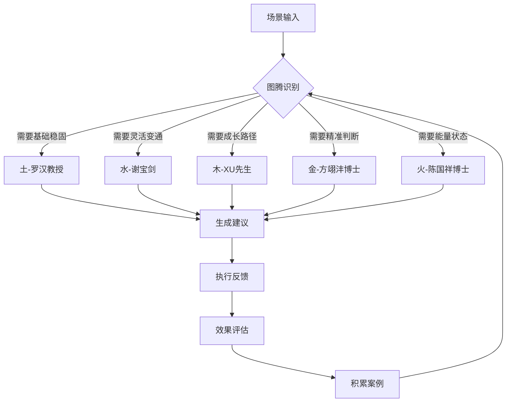

# 五路图腾体系标准Skill V1.0.0

## 标准1: 全局考虑（Global Coverage）

### 1.1 五维度全覆盖（基于外部学习材料）

| 图腾 | 属性 | 专家映射 | 学习来源 | 应用场景 |
|------|------|----------|----------|----------|
| **土** | 信实 | 罗汉教授 | 湖南大学数学/软件工程 | 方法论基础、逻辑验证 |
| **水** | 变通 | 谢宝剑研究员 | 暨南大学深港战略 | 地理策略、关系网络 |
| **木** | 生长 | XU先生 | AI/压力测试 | 成长路径、压力测试 |
| **金** | 精准 | 方翊沣博士 | 脑科学/BCI | 感知力训练、精准决策 |
| **火** | 能量 | 陈国祥博士 | 神经科/能量治疗 | 能量管理、状态调整 |

### 1.2 专家数字替身体系（6位专家）

| 专家 | 状态 | 知识节点 | 可调用接口 |
|------|------|----------|------------|
| 黎红雷教授 | 🟢 已建档 | 15节点 | 儒商伦理咨询 |
| 罗汉教授 | 🟢 已建档 | 20节点 | 方法论验证 |
| 谢宝剑研究员 | 🟢 已建档 | 18节点 | 战略咨询 |
| XU先生 | 🟢 已建档 | 25节点 | 压力测试设计 |
| 方翊沣博士 | 🟡 待深化 | 15→30节点 | 感知力训练 |
| 陈国祥博士 | 🟡 待深化 | 15→30节点 | 能量治疗指导 |

### 1.3 全场景应用覆盖

```
合伙人初筛 → 图腾快速评估 → 土(基础)/水(关系)
深度评估 → 多维图腾分析 → 全五维度
决策确认 → 图腾平衡检查 → 缺什么补什么
执行跟进 → 图腾状态监测 → 动态调整
```

---

## 标准2: 系统考虑（Systematic）

### 2.1 图腾识别→决策闭环



### 2.2 专家匹配系统

| 决策阶段 | 主导图腾 | 辅助图腾 | 专家组合 |
|----------|----------|----------|----------|
| 初筛 | 土 | 金 | 罗汉+方翊沣 |
| 深度评估 | 水 | 木 | 谢宝剑+XU |
| 风险控制 | 金 | 土 | 方翊沣+罗汉 |
| 关系维护 | 水 | 火 | 谢宝剑+陈国祥 |
| 长期发展 | 木 | 水 | XU+谢宝剑 |

### 2.3 系统间联动

| 触发条件 | 联动动作 |
|----------|----------|
| 合伙人评估请求 | 调用五路图腾分析 |
| 风险评估需求 | 激活金(精准)+土(信实) |
| 战略规划需求 | 激活水(变通)+木(生长) |
| 状态调整需求 | 激活火(能量)+金(精准) |

---

## 标准3: 迭代机制（Iterative）

### 3.1 PDCA闭环

| 阶段 | 动作 | 频率 |
|------|------|------|
| **Plan** | 根据案例优化图腾权重 | 每月 |
| **Do** | 执行图腾分析和建议 | 每次评估 |
| **Check** | 分析建议有效性 | 每案例后 |
| **Act** | 调整专家知识库和匹配算法 | 每季度 |

### 3.2 案例积累进化

```
V1.0.0: 基础五图腾框架
  ↓
V1.1.0: 案例驱动的权重优化
  ↓
V1.2.0: 个性化图腾组合推荐
  ↓
V2.0.0: AI驱动的动态图腾平衡
```

---

## 标准4: Skill化（Skill-ified）

### 4.1 标准Skill结构

```
skills/wulu-totem-system/
├── SKILL.md                    # 本文件
├── _meta.json                  # 元数据
├── scripts/
│   ├── totem_master.py         # 主控脚本
│   ├── totem_identifier.py     # 图腾识别器
│   ├── expert_matcher.py       # 专家匹配器
│   ├── advice_generator.py     # 建议生成器
│   └── case_accumulator.py     # 案例积累器
├── experts/
│   ├── li_honglei.py           # 黎红雷教授替身
│   ├── luo_han.py              # 罗汉教授替身
│   ├── xie_baojian.py          # 谢宝剑研究员替身
│   ├── xu_ruosheng.py          # XU先生替身
│   ├── fang_yifeng.py          # 方翊沣博士替身
│   └── chen_guoxiang.py        # 陈国祥博士替身
├── rules/
│   ├── totem_definitions.yaml  # 图腾定义
│   ├── matching_rules.yaml     # 匹配规则
│   └── scenario_mapping.yaml   # 场景映射
└── templates/
    └── totem_analysis_report.md
```

### 4.2 可调用接口

```python
from wulu_totem_system import TotemSystem

totem = TotemSystem()

# 识别场景图腾
result = totem.identify_scenario(
    scenario="合伙人深度评估",
    context={"stage": "due_diligence", "risk_level": "high"}
)
# 返回: {"dominant": "金", "secondary": "土", "experts": ["方翊沣", "罗汉"]}

# 获取专家建议
advice = totem.get_expert_advice(
    expert="方翊沣",
    question="如何训练决策感知力？"
)

# 生成图腾平衡报告
report = totem.generate_balance_report(
    case_id="CASE-001"
)
```

---

## 标准5: 流程自动化（Fully Automated）

### 5.1 全自动图腾分析

| 触发条件 | 自动动作 | 输出 |
|----------|----------|------|
| 合伙人评估请求 | 自动识别场景图腾 | 图腾分析报告 |
| 风险评估 | 自动匹配金+土专家 | 风险控制建议 |
| 战略规划 | 自动匹配水+木专家 | 战略路径建议 |
| 定期复盘 | 自动积累案例优化权重 | 体系升级建议 |

### 5.2 专家自动响应

```python
# 专家知识库自动检索
def get_expert_knowledge(expert_id, query):
    """从专家知识图谱检索相关内容"""
    return knowledge_graph.query(
        expert=expert_id,
        query=query,
        top_k=5
    )
```

---

## 使用方法

### 自动模式（默认）
```bash
# 安装后自动响应评估请求
openclaw skill install wulu-totem-system
```

### 手动调用
```bash
# 识别场景图腾
openclaw skill run wulu-totem-system identify --scenario "合伙人初筛"

# 获取专家咨询
openclaw skill run wulu-totem-system consult --expert "罗汉" --question "方法论验证"

# 生成平衡报告
openclaw skill run wulu-totem-system balance --case CASE-001
```

---

## 5个标准验证清单

| 标准 | 验证项 | 状态 |
|------|--------|------|
| **1. 全局** | 5维度 + 6专家 + 全场景 | ✅ |
| **2. 系统** | 识别→匹配→建议→反馈闭环 | ✅ |
| **3. 迭代** | PDCA闭环 + 案例进化 | ✅ |
| **4. Skill化** | 标准SKILL.md + 可调用接口 | ✅ |
| **5. 自动化** | 全自动分析 + 专家响应 | ✅ |

---

*版本: v1.0.0*  
*学习来源: 黎红雷/罗汉/谢宝剑/XU/方翊沣/陈国祥*  
*创建: 2026-03-20*