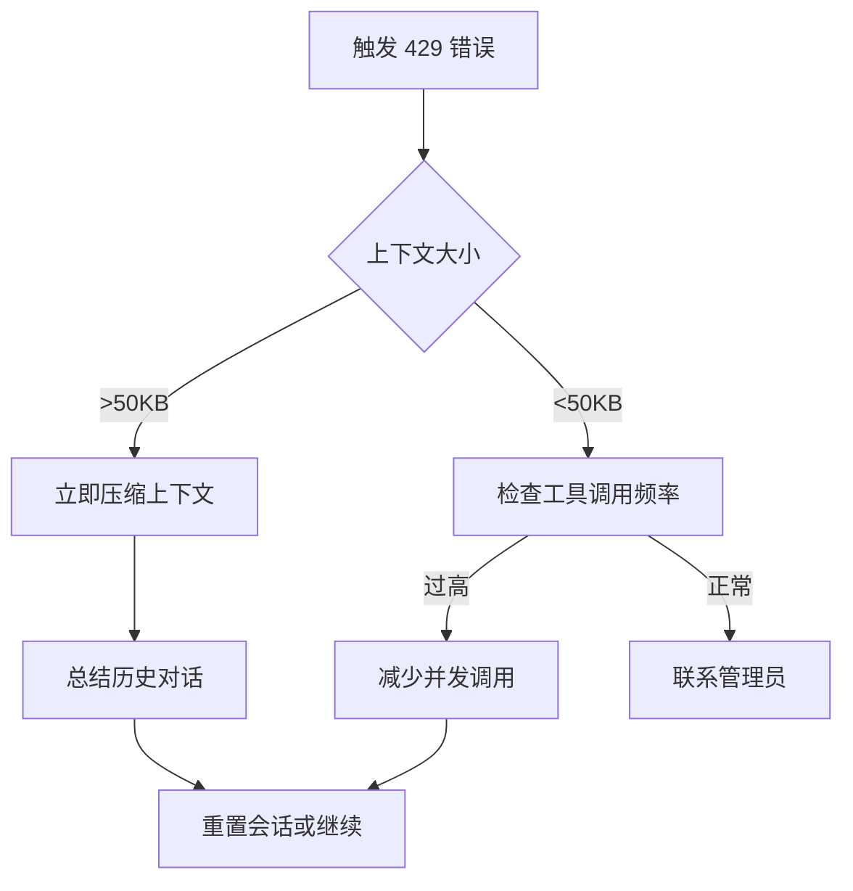

# 429 错误预防机制文档

## 📋 概述

HTTP 429 (Too Many Requests) 错误是 OpenClaw 系统中最常见的限流错误。本文档提供根本原因分析、预防措施和自动化监控方案。

---

## 🔍 根本原因分析

### 1. 上下文大小超限
| 阈值 | 状态 | 影响 |
|------|------|------|
| 30KB | 黄色预警 | API 调用效率下降 |
| 50KB | 红色预警 | 触发限流，返回 429 错误 |
| >50KB | 危险区 | 频繁触发，会话中断 |

**根本原因：**
- 长对话累积大量历史消息
- 工具调用结果占用过多 tokens
- 系统提示词和上下文重复累加

### 2. 工具调用频率过高
| 单轮调用数 | 风险等级 |
|-----------|----------|
| ≤3 | 安全 |
| 4-5 | 建议优化 |
| >5 | 高风险，可能触发 429 |

**根本原因：**
- 单轮对话中并行发起过多工具调用
- 循环调用未设置上限
- 递归操作无终止条件

### 3. 对话轮数累积
| 轮数 | 建议操作 |
|------|----------|
| <50 | 正常运行 |
| 50-100 | 关注上下文增长 |
| >100 | 建议新开会话，重置上下文 |

---

## 🛡️ 预防措施

### 措施 1：上下文阈值监控

```yaml
# 阈值配置
context_thresholds:
  yellow: 30720   # 30KB - 建议压缩
  red: 51200      # 50KB - 强制压缩
  max: 65536      # 64KB - 会话中断风险
```

**操作建议：**
- 达到 30KB：启动上下文压缩流程
- 达到 50KB：强制总结历史对话，仅保留关键信息
- 超过 64KB：建议立即新开会话

### 措施 2：工具调用限制

```python
# 工具调用限制配置
tool_call_limits:
  per_turn: 5        # 单轮最大调用数
  parallel: 3        # 并行调用建议上限
  burst_window: 60   # 突发窗口（秒）
```

**最佳实践：**
1. 单轮工具调用不超过 5 个
2. 优先顺序执行，避免并行轰炸
3. 使用批量查询替代多次单条查询

### 措施 3：对话轮数管理

```yaml
# 对话生命周期管理
conversation_limits:
  soft_limit: 50     # 软限制，提醒用户
  hard_limit: 100    # 硬限制，建议新开会话
  auto_reset: 150    # 自动重置阈值
```

**管理策略：**
- 50 轮后：提示用户上下文增长
- 100 轮后：强烈建议新开会话
- 150 轮后：自动归档当前会话

### 措施 4：上下文压缩策略

```python
# 压缩策略配置
compression_strategies:
  - type: "summary"      # 摘要压缩，保留关键决策
  - type: "truncate"     # 截断旧消息
  - type: "archival"     # 归档到文件
```

**压缩触发条件：**
- 手动触发：用户主动请求压缩
- 自动触发：达到黄色/红色阈值
- 定时触发：工作流定期检查

---

## 🤖 自动化监控方案

### 监控脚本
- **路径：** `/root/.openclaw/skills/error-handler/scripts/context_monitor.py`
- **功能：**
  - 实时监控对话上下文大小
  - 超过阈值自动提醒
  - 建议压缩时机

### GitHub Actions 工作流
- **路径：** `.github/workflows/context-check.yml`
- **触发：** 定期执行（每 30 分钟）
- **功能：**
  - 检查上下文状态
  - 生成压缩建议报告
  - 自动创建 issue（严重情况）

---

## 🚨 紧急处理流程

### 当 429 错误发生时



### 应急操作步骤

1. **立即停止当前操作**
   ```
   暂停所有非必要工具调用
   ```

2. **评估上下文状态**
   ```bash
   # 运行监控脚本
   python /root/.openclaw/skills/error-handler/scripts/context_monitor.py
   ```

3. **执行压缩（如需要）**
   ```
   /compress - 触发上下文压缩
   /reset   - 重置会话（最后手段）
   ```

4. **记录事件**
   - 记录触发时间
   - 记录上下文大小
   - 记录触发操作
   - 更新预防措施

---

## 📊 监控指标

| 指标 | 正常范围 | 警告阈值 | 危险阈值 |
|------|----------|----------|----------|
| 上下文大小 | <30KB | 30-50KB | >50KB |
| 单轮工具调用 | ≤3 | 4-5 | >5 |
| 对话轮数 | <50 | 50-100 | >100 |
| 429 错误频率 | 0 | 1-2/小时 | >3/小时 |

---

## 🔧 配置参考

### 环境变量
```bash
# 阈值配置（可选）
export CONTEXT_YELLOW_THRESHOLD=30720
export CONTEXT_RED_THRESHOLD=51200
export TOOL_CALL_LIMIT_PER_TURN=5
export CONVERSATION_TURN_LIMIT=100

# 监控配置
export CONTEXT_MONITOR_INTERVAL=300  # 5分钟
```

### 快速检查命令
```bash
# 检查当前上下文大小
python /root/.openclaw/skills/error-handler/scripts/context_monitor.py

# 查看 GitHub Actions 状态
gh run list --workflow=context-check.yml
```

---

## 📝 更新日志

| 日期 | 版本 | 变更内容 |
|------|------|----------|
| 2026-03-10 | 1.0.0 | 初始版本，建立 429 预防机制 |

---

## 🔗 相关资源

- 监控脚本：`/root/.openclaw/skills/error-handler/scripts/context_monitor.py`
- 工作流：`.github/workflows/context-check.yml`
- 错误处理技能：`/root/.openclaw/skills/error-handler/`
