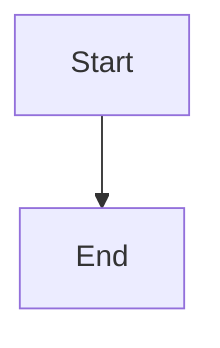

# mermaid-diagrams

Create diagrams and flowcharts using Mermaid syntax.

## Usage

Create .mmd files and render them:

```mermaid
graph TD
    A[Start] --> B[End]
```

Use mmdc CLI to render to images.